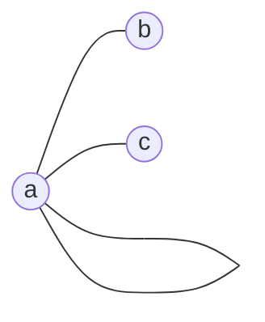
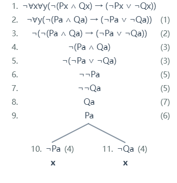
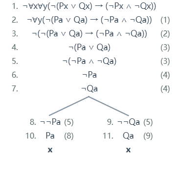
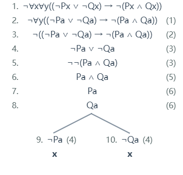
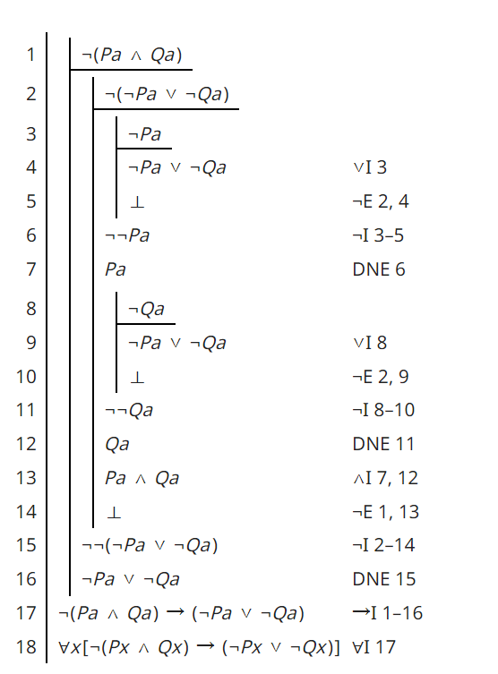
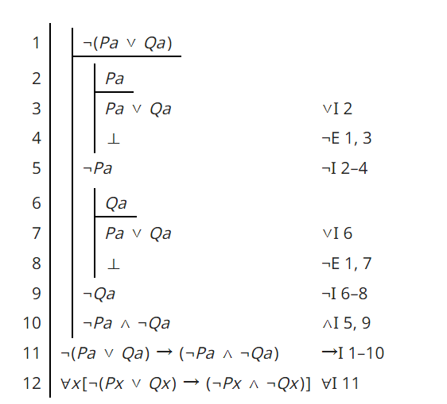
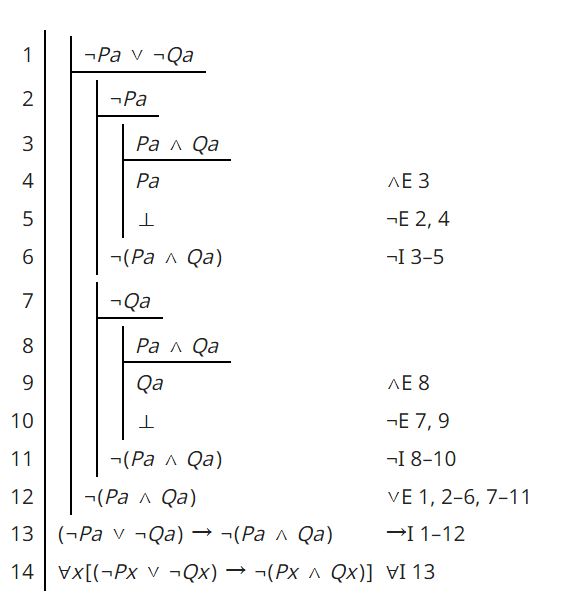
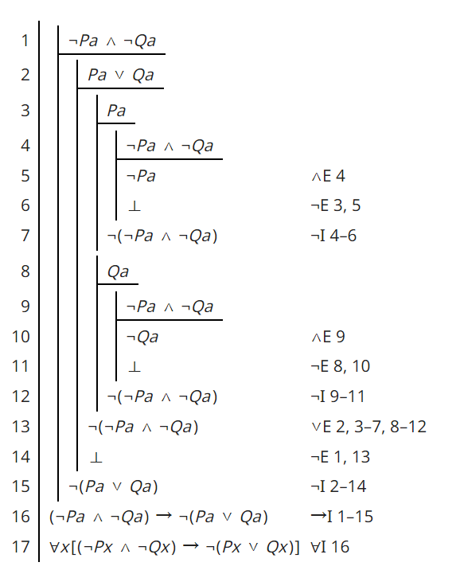

# Project 1 Assignment

Your first project will require you to answer each of the 10 questions below.  You will be expected to open a pull request with your initial answers by the second class meeting, giving you one week to work on these problems. You and your peers will then have one week to work together to refine your respective initial answers, so they are ready for final submission. Once your pull requests have been reviewed and merged to the development branch, I will review them, then merge to the master branch. 

```Tip #1: Carefully study the Hedman selections assigned, as several of the questions are taken directly from the textbook. 
Tip #2: Google is your friend. An important skill to pick up in this class is recognizing when to think hard and when to think smart. You might find answers to some of the questions below simply by googling; you might find pieces of answers to parts of some question below, which will need to be combined; then again, you might not find any help at all because the questions are more novel than they initially appear. I encourage you to use existing resources as guidance, but be careful. My reputation for asking students tricky questions is well-earned. 
Tip #3: Work _together_ to solve these problems, even for initial submissions and when you do, document this in github. For example, you might feel like you nearly have answers to question 1, but would love another pair of eyes. You can then open a post in your local github account, and tag folks from class requesting they check out your work. 
Tip #4: The work we do is challenging; that should be assumed. You are smart enough to be here; that should also be assumed. We have neither time nor space for shaming, but all of time and space for praising. Be cognizant of how your messages might be received, and err on the side of caution. It is hard to surmise intent from text alone. For my part, I treat text only communications the way modern musicals are written: Little subtext; emotions on the sleeve. 
```

Note: The standard interpretation of the logical symbols - "∨", "∧", "→", "¬", "∀", "∃" - is assumed throughout. 

[1] Provide the truth tables for each of the following propositional logic formulas. State whether each is a tautology, a contradiction, or contingent:
  ```(a) (¬A→B)∨((A∧¬C)→B) 
  (b) (A→B)∧(A→¬B)
  (c) (A→(B∨C))∨(C→¬A) 
  (d) ((A→B)∧C)∨(A∧D) 
```

Answer: 

(a) Tautology
| A | B	| C | ¬A→B | A∧¬C | (A∧¬C)→B | (¬A→B)∨((A∧¬C)→B) |
| ---  | --- | --- | --- | --- | --- | --- |
| 1 | 1 | 1 | 1 | 0 | 1 | 1 |
| 1 | 1 | 0 | 1 | 1 | 1 | 1 |
| 1 | 0 | 1 | 1 | 0 | 1 | 1 |
| 0 | 1 | 1 | 1 | 0 | 1 | 1 |
| 1 | 0 | 0 | 1 | 1 | 0 | 1 |
| 0 | 1 | 0 | 1 | 0 | 1 | 1 |
| 0 | 0 | 1 | 0 | 0 | 1 | 1 |
| 0 | 0 | 0 | 0 | 0 | 1 | 1 |

(b) Contingent
| A | B	| A→B | A→¬B | (A→B)∧(A→¬B) | 
| ---  | --- | --- | --- | --- |
| 1 | 1 | 1 | 0 | 0 | 
| 1 | 0 | 0 | 1 | 0 |
| 0 | 1 | 1 | 1 | 1 |
| 0 | 0 | 1 | 1 | 1 | 

(c) Tautology
| A | B	| C | B∨C | A→(B∨C) | C→¬A | (A→(B∨C))∨(C→¬A)) |
| ---  | --- | --- | --- | --- | --- | --- |
| 1 | 1 | 1 | 1 | 1 | 0 | 1 |
| 1 | 1 | 0 | 1 | 1 | 1 | 1 |
| 1 | 0 | 1 | 1 | 1 | 0 | 1 |
| 0 | 1 | 1 | 1 | 1 | 1 | 1 |
| 1 | 0 | 0 | 0 | 0 | 1 | 1 |
| 0 | 1 | 0 | 1 | 1 | 1 | 1 |
| 0 | 0 | 1 | 1 | 1 | 1 | 1 |
| 0 | 0 | 0 | 0 | 1 | 1 | 1 |

(d) Contingent
| A | B	| C | D | A→B | (A→B)∧C | A∧D | ((A→B)∧C)∨(A∧D)
| ---  | --- | --- | --- | --- | --- | --- |--- |
| 1  | 1 | 1 | 1 | 1 | 1 | 1 | 1 |
| 1  | 1 | 1 | 0 | 1 | 1 | 0 | 1 |
| 1  | 1 | 0 | 1 | 1 | 0 | 1 | 1 |
| 1  | 0 | 1 | 1 | 0 | 0 | 1 | 1 |
| 0  | 1 | 1 | 1 | 1 | 1 | 0 | 1 |
| 1  | 1 | 0 | 0 | 1 | 0 | 0 | 0 |
| 1  | 0 | 1 | 0 | 0 | 0 | 0 | 0 |
| 0  | 0 | 1 | 1 | 1 | 1 | 0 | 1 |
| 0  | 1 | 1 | 0 | 1 | 1 | 0 | 1 |
| 0  | 1 | 0 | 1 | 1 | 0 | 0 | 0 |
| 1  | 0 | 0 | 1 | 0 | 0 | 1 | 1 |
| 0  | 0 | 0 | 1 | 1 | 0 | 0 | 0 |
| 0  | 0 | 1 | 0 | 1 | 1 | 0 | 1 |
| 0  | 1 | 0 | 0 | 1 | 0 | 0 | 0 |
| 1  | 0 | 0 | 0 | 0 | 0 | 0 | 0 |
| 0  | 0 | 0 | 0 | 1 | 0 | 0 | 0 |

[2] A _literal_ is an atomic formula or the negation of an atomic formula. We say a formula is in _conjunctive normal form_ (CNF) if it is the conjunction of the disjunction of literals. Find propositional logic formulas in CNF equivalent to each of the following:
  ```(a) (A→B)→C
  (b) (A→(B∨C))∨(C→¬A)
  (c) (¬A∧¬B∧C)∨(¬A∧¬C)∨(B∧C)∨A 
```
Answer:

(a) CNF: (A∨C)∧(¬B∨C)

(b) CNF: B∨¬A

(c) CNF: B∨¬B (the CNF of a tautology is any formula of the form "p∨¬p")

[3] Let V be the vocabulary of first-order logic consisting of a binary relation P and a unary relation F. Interpret P(x,y) as “x is a parent of y” and F(x) as “x is female.” Where possible define the following formulas in this vocabulary; where not possible, explain why: 
  ```(a)  B(x,y) that says that x is a brother of y
  (b)  A(x,y) that says that x is an aunt of y
  (c)  C(x,y) that says that x and y are cousins 
  (d)  O(x) that says that x is an only child
  (e)  T(x) that says that x has exactly two brothers 
```

Answer:

(a) B(x,y)=def. ∃u(P(u,x)∧P(u,y))∧¬F(x)∧¬(x=y)

(b) A(x,y)=def. ∃u∃w(P(u,y)∧P(w,x)∧P(w,u)∧¬(x=u))∧F(x)

(c) C(x,y)=def. ∃u∃w∃z(P(w,z)∧P(w,u)∧P(z,x)∧P(u,y)∧¬(z=u))∧¬(x=y)

(d) O(x)=def. ∃u(P(u,x)∧∀y(P(u,y)→x=y))

(e) T(x)=def. ∃u(∃y∃z(¬(y=z)∧¬(x=y)∧¬(x=z)∧P(u,x)∧P(u,y)∧P(u,z)∧¬F(y)∧¬F(z)) ∧ ∀y∀z∀w(P(u,x)∧P(u,y)∧P(u,z)∧P(u,w)∧¬F(y)∧¬F(z)∧¬F(w) → y=z ∨ y=w ∨ z=w ∨ x=y ∨ x=z ∨ x=w))

[4] Let V be a vocabulary of the attribute (concept) language with complements (ALC) consisting of a role name "parent_of" and a concept name "Male". Interpret parent_of as "x is a parent of y" and M as "x is male". Where possible define the following formulas in this vocabulary; where not possible, explain why: 
  ```(a)  B that says that x is a brother of y
  (b)  A that says that x is an aunt of y
  (c)  C that says that x and y are cousins 
  (d)  O that says that x is an only child
  (e)  T that says that x has exactly two brothers 
```

Answer:

(a) $B ≡ Male\sqcap ∃ParentOf^-.(∃ParentOf\ge2)$

(b) $A ≡ ¬Male\sqcap ∃ParentOf^-.((∃ParentOf.(∃ParentOf.Male\sqcup ¬Male))\sqcap∃ParentOf\ge2)$

(c) $C ≡ ∃ParentOf^-.(∃ParentOf^-.(\ge2ParentOf.(ParentOf.Male\sqcup ¬Male)))$

(d) $O ≡ ∃ParentOf^-.(∃ParentOf\le1)$

(e) $T ≡ (Male\sqcap ∃ParentOf^-.(\le3∃ParentOf.Male \sqcap \ge3∃ParentOf.Male))\sqcup(¬Male\sqcap∃ParentOf^-.(\le2∃ParentOf.Male \sqcap \ge2∃ParentOf.Male))$

[5] Select two formulas defined in ALC from question 4 to form the basis of a T-Box. Supplement this T-box with whatever other axioms you like, as well as an A-box, so that you ultimately construct a knowledge base K = (T,A). Provide a _model_ of K. This may be graphical or symbolic or both. 

Answer:

$K_1 = (T_1,A_1)$ such that:

T-box $T_1$={$B ≡ Male\sqcap∃ParentOf^-.(∃ParentOf\ge2)$, 

$O≡∃ParentOf^-.(∃ParentOf\le1)$, 

$GP≡∃ParentOf.(∃ParentOf.Male\sqcup ¬Male)$}

A-box $A_1$={(Mary,Karl):ParentOf, Karl:Male}.

The following is a model $\Im=(\bigtriangleup^\Im,.^\Im)$ of $K_1$:

$\bigtriangleup^\Im$={a,b,c}

$Male^\Im$={a}

$B^\Im=\emptyset$

$O^\Im$={b,a}

$GP^\Im$={c}

$ParentOf^\Im$={(c,b),(b,a)}

$Karl^\Im$={a}

$Mary^\Im$={b}

$Jack^\Im$={c}

[6] Explain the difference - using natural language - between the first-order prefixes:
  ```(a) ∃x∀y and ∀x∃y
  (b) ∃x∀y∃z and ∀x∃y∀z 
  (c) ∀x∃y∀z∃w and ∃x∀y∃z∀w
```
Answer:

(a) ∃x∀y means “there exists x such that for all y” while ∀x∃y means "for all x, there exists y such that"

(b) ∃x∀y∃z means “there exists x such that for all y, there exists z such that” while ∀x∃y∀z means "for all x, there exists y such that for all z"

(c) ∀x∃y∀z∃w means "for all x, there exists y such that for all z, there exists w such that" while ∃x∀y∃z∀w means "there exists x such that for all y, there exists z such that for all y"
	
[7] Show that the following sentences are not equivalent by exhibiting a graph that models one but not both of these sentences:
```
∀x∃y∀z(R(x,y) ∧ R(x,z) ∧ R(y,z))
∃x∀y∃z(R(x,y) ∧ R(x,z) ∧ R(y,z))
```

Answer:

The following graph models the second sentence but not the first sentence:

Verticles: a, b, c

Edges: ab, ac, aa (loop)


	
[8] Using an online tableau proof generator - such as the one found here `https://www.umsu.de/trees/` - provide tree proofs of the following entailments, which are known as the De Morgan's laws:
```
(a) ∀x∀y(¬(Px ∧ Qx) → (¬Px ∨ ¬Qx))
(b) ∀x∀y(¬(Px ∨ Qx) → (¬Px ∧ ¬Qx))
(c) ∀x∀y((¬Px ∨ ¬Qx) → ¬(Px ∧ Qx))
(d) ∀x∀y((¬Px ∧ ¬Qx) → ¬(Px ∨ Qx))
```

Answer:

(a)

  

(b)

  

(c)



(d)


[9] Using a natural deduction proof generator - such as the one found here `https://proofs.openlogicproject.org/` - provide natural deduction proofs for each of De Morgan's laws. 

Answer:

(a) 

 

(b) 

 

(c) 

 

(d) 

 

[10]   Compare and contrast the proofs provided for (a) in your answers to questions 8 and 9. Explain the different assumptions, strategies, etc. exhibited in tree proofs vs natural deduction proofs. 

Answer:

For (a), a Fitch-style natural deduction proof relies on deductive rules like disjunction elimination or double negation elimination (DNE) to a more substantive degree than a tree proof. 

While a Fitch-style natural deduction proof is a combinational application of different means of derivation, a tree proof is essentially an application of indirect derivation. That is, when we do a tree proof, we have to decompose the target (complex) formula into its subformulas, and then differently connect negations of those subformulas in order to form different paths. Once when all paths somehow involve a contradiction, then the opposite possibilities of the target formula are all shown to be implausible, and thus the target formula will be proved.

Moreover, a Fitch-style natural deduction proof is to apply rules to the target formula and its logical consequents, while a tree proof does not apply the same rules but concentrates on finding possible logical contradictions among negated subformulas of the target formula. 
