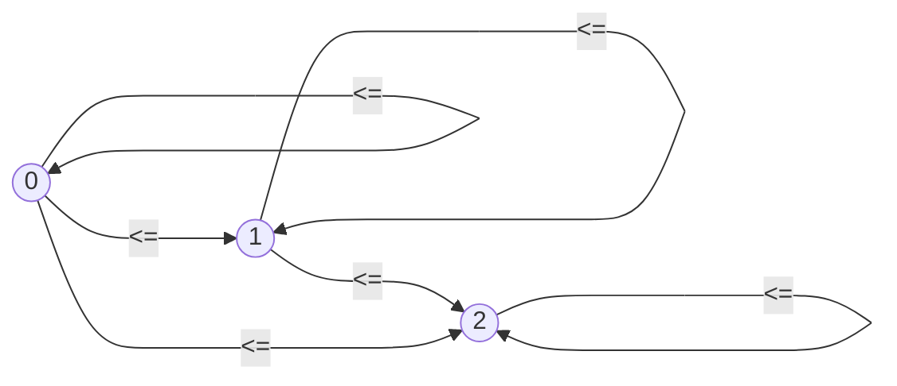

# Question 1
1. Provide the truth tables for each of the following propositional logic formulas. State whether each is a tautology, a contradiction, or contingent:
```
  (a) (¬A→B)∨((A∧¬C)→B) 
  (b) (A→B)∧(A→¬B)
  (c) (A→(B∨C))∨(C→¬A) 
  (d) ((A→B)∧C)∨(A∧D) 
```

## Answers:
(a) `(¬A→B)∨((A∧¬C)→B)` is a tautology
| A | B | C | (¬A→B) | ((A∧¬C)→B) | (¬A→B) ∨ ((A∧¬C)→B) |
| - | - | - | ------ | ---------- | -------------------- |
| T | T | T | T      | T          | T                    |
| T | F | T | T      | T          | T                    |
| F | T | T | T      | T          | T                    |
| F | F | T | F      | T          | T                    |
| T | T | F | T      | T          | T                    |
| T | F | F | T      | F          | T                    |
| F | T | F | T      | T          | T                    |
| F | F | F | F      | T          | T                    |

* (A∧¬C)→B <==> ¬(A∧¬C)∨B <==> (¬A∨C)∨B


(b) `(A→B)∧(A→¬B)` is contingently true
| A | B | (A→B) | (A→¬B) | (A→B) ∧ (A→¬B) |
| - | - | ----- | ------ | -------------- |
| T | T | T     | F      | F              |
| T | F | F     | T      | F              |
| F | T | T     | T      | T              |
| F | F | T     | T      | T              |


(c) `(A→(B∨C))∨(C→¬A)` is a tautology
| A | B | C | (A→(B∨C)) | (C→¬A) | (A→(B∨C)) ∨ (C→¬A) |
| - | - | - | --------- | ------ | ------------------ |
| T | T | T | T         | F      | T                  |
| T | F | T | T         | F      | T                  |
| F | T | T | T         | T      | T                  |
| F | F | T | T         | T      | T                  |
| T | T | F | T         | T      | T                  |
| T | F | F | F         | T      | T                  |
| F | T | F | T         | T      | T                  |
| F | F | F | T         | T      | T                  |


(d) `((A→B)∧C)∨(A∧D)` is contingently true (2<sup>4</sup> booleans is 16 possibilities)
| A | B | C | D | (A→(B∧C)) | (A∧D) | ((A→B)∧C) ∨ (A∧D) |
| - | - | - | - | ---------- | ---- | ------------------ |
| T | T | T | T | T          | T    | T                  |
| T | F | T | T | F          | T    | T                  |
| F | T | T | T | T          | F    | T                  |
| F | F | T | T | T          | F    | T                  |
| T | T | F | T | F          | T    | T                  |
| T | F | F | T | F          | T    | T                  |
| F | T | F | T | F          | F    | F                  |
| F | F | F | T | F          | F    | F                  |
| T | T | T | F | T          | F    | T                  |
| T | F | T | F | F          | F    | F                  |
| F | T | T | F | T          | F    | T                  |
| F | F | T | F | T          | F    | T                  |
| T | T | F | F | F          | F    | F                  |
| T | F | F | F | F          | F    | F                  |
| F | T | F | F | F          | F    | F                  |
| F | F | F | F | F          | F    | F                  |


---
# Question 2
2. A _literal_ is an atomic formula or the negation of an atomic formula. We say a formula is in _conjunctive normal form_ (CNF) if it is the conjunction of the disjunction of literals. Find propositional logic formulas in CNF equivalent to each of the following:
```
  (a) (A→B)→C
  (b) (A→(B∨C))∨(C→¬A)
  (c) (¬A∧¬B∧C)∨(¬A∧¬C)∨(B∧C)∨A 
```

## Answers:
(a) `(A→B)→C`
```
(¬A ∨ B) → C           [→ to ∨]
¬(¬A ∨ B) ∨ C          [→ to ∨]
(A ∧ ¬B) ∨ C           [DeMorgan]
(A ∨ C) ∧ (¬B ∨ C)     [Distribute ∨]

```

(b) `(A→(B∨C))∨(C→¬A)`
```
(¬A ∨ (B ∨ C)) ∨ (¬C ∨ ¬A)     [→ to ∨]
```
| A | B | C | (¬A ∨ (B ∨ C)) | (¬C ∨ ¬A) | (¬A ∨ (B ∨ C)) ∨ (¬C ∨ ¬A) |
| - | - | - | -------------- | --------- | --------------------------- |
| T | T | T | T              | F         | T                           |
| T | F | T | T              | F         | T                           |
| F | T | T | T              | T         | T                           |
| F | F | T | T              | T         | T                           |
| T | T | F | T              | T         | T                           |
| T | F | F | F              | T         | T                           |
| F | T | F | T              | T         | T                           |
| F | F | F | T              | T         | T                           |

This is a tautology, so its equivalent to the CNF formula `(A ∨ ¬A) ∧ (B ∨ ¬B) ∧ (C ∨ ¬C)`


(c) `(¬A ∧ ¬B ∧ C) ∨ (¬A ∧ ¬C) ∨ (B ∧ C) ∨ A`
```
(¬A ∧ ¬B ∧ C) ∨ (¬A ∧ ¬C) ∨ ((B ∨ A) ∧ (A ∨ C))      [Distribute ∨]
```
| A | B | C | (¬A ∧ ¬B ∧ C)  | (¬A ∧ ¬C) | ((B ∨ A) ∧ (A ∨ C)) | (¬A ∧ ¬B ∧ C) ∨ (¬A ∧ ¬C) ∨ ((B ∨ A) ∧ (A ∨ C)) |
| - | - | - | -------------- | --------- | -------------------- | ------------------------------------------------ |
| T | T | T | F              | F         | T                    | T                                                |
| T | F | T | F              | F         | T                    | T                                                |
| F | T | T | F              | F         | T                    | T                                                |
| F | F | T | T              | F         | T                    | T                                                |
| T | T | F | F              | F         | T                    | T                                                |
| T | F | F | F              | F         | T                    | T                                                |
| F | T | F | F              | T         | F                    | T                                                |
| F | F | F | F              | T         | F                    | T                                                |

This is a tautology, so its equivalent to the CNF formula `(A ∨ ¬A) ∧ (B ∨ ¬B) ∧ (C ∨ ¬C)`


---
# Question 3
3. Let V be the vocabulary of first-order logic consisting of a binary relation P and a unary relation F. Interpret P(x,y) as “x is a parent of y” and F(x) as “x is female.” Where possible define the following formulas in this vocabulary; where not possible, explain why: 
```
  (a)  B(x,y) that says that x is a brother of y
  (b)  A(x,y) that says that x is an aunt of y
  (c)  C(x,y) that says that x and y are cousins 
  (d)  O(x) that says that x is an only child
  (e)  T(x) that says that x has exactly two brothers 
```

## Answers:
```
FOL 

// x is brother of y
B(x,y) = ∃x∃y∃p( P(p,x) ∧ P(p,y) ∧ ¬F(x) )

// x is aunt of y
A(x,y) = ∃y∃p∃g∃x( P(p,y) ∧ P(g,p) ∧ P(g,x) ∧ F(x) )

// x is cousin of y
C(x,y) = ∃x∃p∃g∃u∃y( P(p,x) ∧ P(g,p) ∧ P(g,u) ∧ P(u,y) )

// x is an only child
O(x) = ∃x∃p( P(p,x) ∧ ∀y( P(p,y) → y=x ) )

// x has exactly two brothers
T(x) = ∃x∃y∃w∃p(
                  P(p, x) 
                  ∧ P(p,y) ∧ ¬F(y)
                  ∧ P(p,w) ∧ ¬F(w) 
                  ∧ ∀b( P(p,b) → b=y ∨ b=w )
                )
```

---
# Question 4
4. Let V be a vocabulary of the attribute (concept) language with complements (ALC) consisting of a role name "parent_of" and a concept name "Male". Interpret parent_of as "x is a parent of y" and M as "x is male". Where possible define the following formulas in this vocabulary; where not possible, explain why: 
```
  (a)  B that says that x is a brother of y
  (b)  A that says that x is an aunt of y
  (c)  C that says that x and y are cousins 
  (d)  O that says that x is an only child
  (e)  T that says that x has exactly two brothers 
```

## Answers:
### $ALC$
* The description logic $AL$ conventionally consists of:
  * Top $\top$, Bottom $\bot$, Conjunction $\sqcap$, Atomic Negation $\neg A$, Value Restriction $\forall r.C$
* $AL$ extended with $C$ adds Negation (of compound concepts) $\neg C$
  * This allows a derivation of Disjunction $\sqcup$ (from Negation & Conjunction)
  * This allows a derivation of Existential Restriction $∃r.C$ (from Negation & Value Restrction)

### DL Extensions
* None of the provided formulas are strictly definable as roles in $ALC$ in terms of the role `parent_of`
* The DL extension $H$ adds Role Inclusion Axioms $r \sqsubseteq s$, allowing us to define other roles in terms of `parent_of`
* The DL extension $I$ adds Inverse Roles $r^-$, allowing us to express the inverse of `parent_of` 

With these extensions we can define the formulas:

(a) `B that says that x is a brother of y`  
$B ≡ M\sqcap ∃parentOf^-.(∃parentOf)$  

  * "Someone is a brother of someone else iff they're a male and there's a parent of that someone who is also a parent of that someone else"
  * This relation should also be defined as irreflexive, symmetric, and transitive

(b) `A that says that x is an aunt of y`  
$A ≡ \neg M \sqcap ∃parentOf^-.(∃parentOf.(∃parentOf))$

  * "Someone is an aunt of someone else iff they're not male and there's a parent of that someone, who is also a parent of another, who in turn is a parent of that someone else"
  * This relation should be irreflexive, asymmetric, and intransitive

(c) `C that says that x and y are cousins`  
$C ≡ ∃parentOf^-.(∃parentOf^-.(∃parentOf.(∃parentOf))) $  

  * "Someone is a cousin of someone else iff they have a parent, who has a parent, who is the parent of another, who is the parent of that someone else"
  * This relation should be irreflexive, symmetric, and intransitive (for first cousins)


The following formulas can be defined using the DL extension $N$, which adds Number Restrictions $(\leqslant n r)$ and $(\geqslant nr )$ where $n$ is a positive number:

(d) `O that says that x is an only child`  
$O ≡ ∃parentOf^-.((\geqslant 1 parentOf) \sqcap (\leqslant 1 parentOf))$  
  
  * "Someone is an only child iff there is a parent of them, who is a parent of at least and at most 1 (child)." 

(e) `T that says that x has exactly two brothers`  
$T ≡ ∃parentOf^-.((\leqslant 2 parentOf) \sqcap (\geqslant 2 parentOf) \sqcap ∃parentOf.(M)) $  

  * "Someone has exactly two brothers iff there's a parent of them who is the parent of at least and at most two, who are males"

---
# Question 5
5. Select two formulas defined in ALC from question 4 to form the basis of a T-Box. Supplement this T-box with whatever other axioms you like, as well as an A-box, so that you ultimately construct a knowledge base K = (T,A). Provide a _model_ of K. This may be graphical or symbolic or both. 


## Answers:
Knowledge Base $K = (T, A)$

### T-Box $T$
```math
T = \left\{
\begin{array}{rcl}
    B		&≡& M \sqcap ∃parentOf^-.(∃parentOf) \\
    C		&≡& ∃parentOf^-.(∃parentOf^-.(∃parentOf.(∃parentOf))) \\
    siblingOf	&≡& ∃parentOf^-(∃parentOf) \\
    Sibling	&≡& ∃siblingOf \\
\end{array} \right\}
```

### A-Box $A$
```math
A = \left\{
\begin{array}{rcl}
    (Tim, Ralph) 	&:& B \\
    (Ralph, Maynard)	&:& B \\
    (Tim, Maynard)	&:& B \\
    (Matt, Tim)		&:& C \\
    (Jill, Tim)		&:& siblingOf \\
    Tim			&:& Sibling \\
    Ralph		&:& Sibling \\
\end{array}
\right\}
```

### Interpretation $I$
```math
I = \left\{
\begin{array}{rcl}
    \Delta^I		&=& \set{t, j, r, q, m, 5, 1} \\
    Tim^I		&=& t \\
    Jill^I		&=& j \\
    Ralph^I		&=& r \\
    Maynard^I		&=& q \\
    Matt^I		&=& m \\
    Extra^I		&=& 5 \\
    CoolestGuy^I	&=& t \\ 
    B^I			&=& \set{(t, r), (r, q), (t, q)} \\
    C^I			&=& \set{(m, t)} \\
    siblingOf^I		&=& \set{(j, t), (t, q) } \\
    Sibling^I		&=& \set{t, r} \\
\end{array}
\right\}
```

$I_1$ is a model of $K$ because it satisfies every axiom of $T$ and every assertion of $A$. 

It's still a model even though:
* It interprets concept names not in the knowledge base, $Extra$ and $CoolestGuy$
* Extra elements are in the extension of $siblingOf$
* The same element $t$ satisfies multiple concept names, $Tim$ and $CoolestGuy$, without a Unique Name Assumption preventing this
* Axiom $Sibling \equiv ∃siblingOf$ plus the assertion that $Ralph : Sibling$ means someone is a sibling of Ralph, but no relation satisfies this. The Open World Assumption allows for incomplete knowledge about who is Ralph's sibling.

---
# Question 6
6. Explain the difference - using natural language - between the first-order prefixes:
```
(a) ∃x∀y and ∀x∃y
(b) ∃x∀y∃z and ∀x∃y∀z 
(c) ∀x∃y∀z∃w and ∃x∀y∃z∀w
```

## Answers:
(a) 
* `∃x∀y` means "There exists some x such that for all y".
* `∀x∃y` means "For all x, there exists some y".

(b)
* `∃x∀y∃z` means "There exists some x such that, for all y, there exists some z".
* `∀x∃y∀z` means "For all x, there exists some y such that for all z".

(c)
* `∀x∃y∀z∃w` means "For all x there exists some y such that for all z there exists some w".
* `∃x∀y∃z∀w` means "There exists some x such that for all y there exists some z such that for all w".


---
# Question 7
7. Show that the following sentences are not equivalent by exhibiting a graph that models one but not both of these sentences:
```
∀x∃y∀z(R(x,y) ∧ R(x,z) ∧ R(y,z))
∃x∀y∃z(R(x,y) ∧ R(x,z) ∧ R(y,z))
```

## Answers:


* Interpretation of `R` as less than or equal to (`<=`) with the domain `{0, 1, 2}`
* This models `∃x∀y∃z(R(x,y) ∧ R(x,z) ∧ R(y,z))` because in this domain there's something that is less than or equal to everything
* This doesn't model `∀x∃y∀z(R(x,y) ∧ R(x,z) ∧ R(y,z))` because not everything is less than or equal to everything (`∀x∀y(R(x,y))`): 2 is not less than or equal to 0


---
# Question 8
8. Using an online tableau proof generator - such as the one found here `https://www.umsu.de/trees/` - provide tree proofs of the following entailments, which are known as the De Morgan's laws:
```
(a) ∀x∀y(¬(Px ∧ Qx) → (¬Px ∨ ¬Qx))
(b) ∀x∀y(¬(Px ∨ Qx) → (¬Px ∧ ¬Qx))
(c) ∀x∀y((¬Px ∨ ¬Qx) → ¬(Px ∧ Qx))
(d) ∀x∀y((¬Px ∨ ¬Qx) → ¬(Px ∧ Qx))
```

## Answers:

(a) ∀x∀y(¬(Px ∧ Qx) → (¬Px ∨ ¬Qx)) is valid
```
        1.¬∀x∀y(¬(Px ∧ Qx) → (¬Px ∨ ¬Qx))
        2.¬∀y(¬(Pa ∧ Qa) → (¬Pa ∨ ¬Qa))     (1)
        3.¬(¬(Pa ∧ Qa) → (¬Pa ∨ ¬Qa))       (2)
        4.¬(Pa ∧ Qa)                        (3)
        5.¬(¬Pa ∨ ¬Qa)                      (3)
        6.¬¬Pa                              (5)
        7.¬¬Qa                              (5)
        8.Qa                                (7)
        9.Pa                                (6)
10.¬Pa          11.¬Qa                      (4, 4)
x               x
```

(b) ∀x∀y(¬(Px ∨ Qx) → (¬Px ∧ ¬Qx)) is valid
```
        1.¬∀x∀y(¬(Px ∨ Qx) → (¬Px ∧ ¬Qx))
        2.¬∀y(¬(Pa ∨ Qa) → (¬Pa ∧ ¬Qa))       (1)
        3.¬(¬(Pa ∨ Qa) → (¬Pa ∧ ¬Qa))         (2)
        4.¬(Pa ∨ Qa)                          (3)
        5.¬(¬Pa ∧ ¬Qa)                        (3)
        6.¬Pa                                 (4)
        7.¬Qa                                 (4)
8.¬¬Pa          9.¬¬Qa                        (5,5)
10.Pa           11.Qa                         (8, 9)
x               x
```


(c) ∀x∀y((¬Px ∨ ¬Qx) → ¬(Px ∧ Qx)) is valid
```
        1.¬∀x∀y((¬Px ∨ ¬Qx) → ¬(Px ∧ Qx))
        2.¬∀y((¬Pa ∨ ¬Qa) → ¬(Pa ∧ Qa))         (1)
        3.¬((¬Pa ∨ ¬Qa) → ¬(Pa ∧ Qa))           (2)
        4.¬Pa ∨ ¬Qa                             (3)
        5.¬¬(Pa ∧ Qa)                           (3)
        6.Pa ∧ Qa                               (5)
        7.Pa                                    (6)
        8.Qa                                    (6)
9.¬Pa           10.¬Qa                          (4,4)
x               x
```


(d) ∀x∀y((¬Px ∨ ¬Qx) → ¬(Px ∧ Qx)) is valid
```
        1.¬∀x∀y((¬Px ∨ ¬Qx) → ¬(Px ∧ Qx))
        2.¬∀y((¬Pa ∨ ¬Qa) → ¬(Pa ∧ Qa))         (1)
        3.¬((¬Pa ∨ ¬Qa) → ¬(Pa ∧ Qa))           (2)
        4.¬Pa ∨ ¬Qa                             (3)
        5.¬¬(Pa ∧ Qa)                           (3)
        6.Pa ∧ Qa                               (5)
        7.Pa                                    (6)
        8.Qa                                    (6)
9.¬Pa           10.¬Qa                          (4,4)
x               x
```

---
# Question 9
9. Using a natural deduction proof generator - such as the one found here `https://proofs.openlogicproject.org/` - provide natural deduction proofs for each of De Morgan's laws. 

## Answers:
(a) ∀x∀y(¬(Px ∧ Qx) → (¬Px ∨ ¬Qx))
```
1.  |   | ¬(Pa ∧ Qa)                              Assumption
2.  |   |   | ¬(¬Pa ∨ ¬Qa)                        Assumption
3.  |   |   |   | ¬Pa                             Assumption
4.  |   |   |   | ¬Pa ∨ ¬Qa                       3, ∨I
5.  |   |   |   | ⊥                               2, 4, ¬E
6.  |   |   | ¬¬Pa                                3-5, ¬I
7.  |   |   | Pa                                  5, ¬¬E
8.  |   |   |   | ¬Qa                             Assumption
9.  |   |   |   | ¬Pa ∨ ¬Qa                       8, ∨I
10. |   |   |   | ⊥                               2, 9, ¬E
11. |   |   | ¬¬Qa                                8-10, ¬I
12. |   |   | Qa                                  11, ¬¬E
13. |   |   | Pa ∧ Qa                             7, 11, ∧I
14. |   |   | ⊥                                   1, 13, ¬E
15. |   | ¬¬(¬Pa ∨ ¬Qa)                           2-14, ¬I
16. |   | (¬Pa ∨ ¬Qa)                             15, ¬¬E
17. | ¬(Pa ∧ Qa) → (¬Pa ∨ ¬Qa)                    1-16, →I
18. | ∀x∀y(¬(Px ∧ Qx) → (¬Px ∨ ¬Qx))              17, ∀I
```

(b) ∀x∀y(¬(Px ∨ Qx) → (¬Px ∧ ¬Qx))
```
1.  |   | ¬(Pa ∨ Qa)                              Assumption
2.  |   |   | Pa                                  Asumption
3.  |   |   | Pa ∨ Qa                             2, ∨I
4.  |   |   | ⊥                                   1, 3, ¬E
5.  |   | ¬Pa                                     2-4, ¬I
6.  |   |   | Qa                                  Assumption
7.  |   |   | Pa ∨ Qa                             6, ∨I
8.  |   |   | ⊥                                   1, 7, ¬E
9.  |   | ¬Qa                                     6-8, ¬I
10. |   | ¬Pa ∧ ¬Qa                               5, 9, ∧I
11. | ¬(Pa ∨ Qa) → (¬Pa ∧ ¬Qa)                    1-10, →I
12. | ∀x∀y(¬(Px ∨ Qx) → (¬Px ∧ ¬Qx))              11, ∀I
```

(c) ∀x∀y((¬Px ∨ ¬Qx) → ¬(Px ∧ Qx))
```
1.  |   | (¬Pa ∨ ¬Qa)                             Assumption
2.  |   |   | ¬Pa                                 Asumption
3.  |   |   |   | Pa ∧ Qa                         Assumption
4.  |   |   |   | Pa                              3, ∧E
5.  |   |   |   | ⊥                               2, 4, ¬E
6.  |   |   | ¬(Pa ∧ Qa)                          3-5, ¬I
7.  |   |   | ¬Qa                                 Assumption
8.  |   |   |   | Pa ∧ Qa                         Assumption
9.  |   |   |   | Qa                              8, ∧E
10. |   |   |   | ⊥                               7, 9, ¬E
11. |   |   | ¬(Pa ∧ Qa)                          5, 9, ∧I
12. |   | ¬(Pa ∧ Qa)                              1, 2-6, 7-11, ∨E
13. | (¬Pa ∨ ¬Qa) → ¬(Pa ∧ Qa)                    1-12, →I
14. | ∀x∀y((¬Px ∨ ¬Qx) → ¬(Px ∧ Qx))              13, ∀I
```

(d) ∀x∀y((¬Px ∧ ¬Qx) → ¬(Px ∨ Qx))
```
1.  |   | ¬Pa ∧ ¬Qa                                Assumption
2.  |   |   | Pa ∨ Qa                              Assumption
3.  |   |   |   | Pa                               Assumption
4.  |   |   |   |   | ¬Pa ∧ ¬Qa                    Assumption
5.  |   |   |   |   | ¬Pa                          4, ∧E
6.  |   |   |   |   | ⊥                            3, 5, ¬E
7.  |   |   |   | ¬(¬Pa ∧ ¬Qa)                     4-6, ¬I
8.  |   |   |   | Qa                               Assumption
9.  |   |   |   |   | ¬Pa ∧ ¬Qa                    Assumption
10. |   |   |   |   | ¬Qa                          9, ∧E
11. |   |   |   |   | ⊥                            8, 10, ¬E
12. |   |   |   | ¬(¬Pa ∧ ¬Qa)                     9-11, ¬I
13. |   |   | ¬(¬Pa ∧ ¬Qa)                         2, 3-7, 8-12, ∨E
14. |   |   | ⊥                                    1, 13, ¬E
15. |   |  ¬(Pa ∨ Qa)                              2-14, ¬I
16. | (¬Pa ∧ ¬Qa) → ¬(Pa ∨ Qa)                     1-15, →I
17. | ∀x∀y((¬Px ∧ ¬Qx) → ¬(Px ∨ Qx))               16, ∀I
```


---
# Question 10
10. Compare and contrast the proofs provided for (a) in your answers to questions 8 and 9. Explain the different assumptions, strategies, etc. exhibited in tree proofs vs natural deduction proofs. 

## Answers:
Tree proofs are used for proofs by contradiction, by assuming the opposite of the intended conclusion and then deriving a contradiction. By contrast, natural deduction proofs may consist of applying rules of derivation to try and reach the conclusion as a goal, however they may also employ proofs by contradiction.