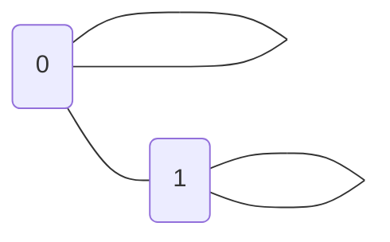

# Project 1 Assignment

Your first project will require you to answer each of the 10 questions below.  You will be expected to open a pull request with your initial answers by the second class meeting, giving you one week to work on these problems. You and your peers will then have one week to work together to refine your respective initial answers, so they are ready for final submission. Once your pull requests have been reviewed and merged to the development branch, I will review them, then merge to the master branch. 

```Tip #1: Carefully study the Hedman selections assigned, as several of the questions are taken directly from the textbook. 
Tip #2: Google is your friend. An important skill to pick up in this class is recognizing when to think hard and when to think smart. You might find answers to some of the questions below simply by googling; you might find pieces of answers to parts of some question below, which will need to be combined; then again, you might not find any help at all because the questions are more novel than they initially appear. I encourage you to use existing resources as guidance, but be careful. My reputation for asking students tricky questions is well-earned. 
Tip #3: Work _together_ to solve these problems, even for initial submissions and when you do, document this in github. For example, you might feel like you nearly have answers to question 1, but would love another pair of eyes. You can then open a post in your local github account, and tag folks from class requesting they check out your work. 
Tip #4: The work we do is challenging; that should be assumed. You are smart enough to be here; that should also be assumed. We have neither time nor space for shaming, but all of time and space for praising. Be cognizant of how your messages might be received, and err on the side of caution. It is hard to surmise intent from text alone. For my part, I treat text only communications the way modern musicals are written: Little subtext; emotions on the sleeve. 
```

Note: The standard interpretation of the logical symbols - "∨", "∧", "→", "¬", "∀", "∃" - is assumed throughout. 

1. Provide the truth tables for each of the following propositional logic formulas. State whether each is a tautology, a contradiction, or contingent:

(a) (¬A→B)∨((A∧¬C)→B: Tatuology
  
| A | B | C | ((¬A → B) ∨ ((A ∧ ¬C) → B)) |  
|:---:|:---:|:---:|:-----------------------------:|
| F | F | F | T                           |   
| F | F | T | T                           |   
| F | T | F | T                           |   
| F | T | T | T                           |   
| T | F | F | T                           |  
| T | F | T | T                           |   
| T | T | F | T                           |   
| T | T | T | T                           |   

(b) (A→B)∧(A→¬B): Contingent
  
| A | B | ((A → B) ∧ (A → ¬B)) |
|:-:|:-:|:--------------------:|
| F | F |           T          |  
| F | T |           T          |   
| T | F |           F          |   
| T | T |           F          |
  
(c) (A→(B∨C))∨(C→¬A): Tautology

| A | B | C | ((A → (B ∨ C)) ∨ (C → ¬A)) |   
|:-:|:-:|:-:|:--------------------------:|
| F | F | F |              T             |   
| F | F | T |              T             |   
| F | T | F |              T             |   
| F | T | T |              T             |   
| T | F | F |              T             |   
| T | F | T |              T             |   
| T | T | F |              T             |   
| T | T | T |              T             |   
  
(d) ((A→B)∧C)∨(A∧D): Contingent

| A | B | C | D | (((A → B) ∧ C) ∨ (A ∧ D)) |
|:-:|:-:|:-:|:-:|:-------------------------:|
| F | F | F | F |             F             |
| F | F | F | T |             F             |
| F | F | T | F |             T             |
| F | F | T | T |             T             |
| F | T | F | F |             F             |
| F | T | F | T |             F             |
| F | T | T | F |             T             |
| F | T | T | T |             T             |
| T | F | F | F |             F             |
| T | F | F | T |             T             |
| T | F | T | F |             F             |
| T | F | T | T |             T             |
| T | T | F | F |             F             |
| T | T | F | T |             T             |
| T | T | T | F |             T             |
| T | T | T | T |             T             |


	
2. A _literal_ is an atomic formula or the negation of an atomic formula. We say a formula is in _conjunctive normal form_ (CNF) if it is the conjunction of the disjunction of literals. Find propositional logic formulas in CNF equivalent to each of the following:

Conjunction normal form is a conjunction (^). We will use this to connect disjunctions. 
  
(a) (A→B)→C = (~A ∨ B) → C = ~(~A ∨ B) ∨ C = (~~A ∧ ~B) ∨ C = (A ∧ ~B) ∨ C = **(A ∨ C) ∧ (~B ∨ C)** [Distribution rule]  
    
(b) (A→(B∨C))∨(C→¬A) = (~A ∨ (B ∨ C)) ∨ (~C ∨ ~A) = (B ∨ C) ∨ (~C ∨ ~A) = **B ∨ ~A**
  
(c) (¬A∧¬B∧C)∨(¬A∧¬C)∨(B∧C)∨A = **A ∨ ~A**

According to this truth table, this sentence is a tautology. Thus, this sentence can be reduced to A ∨ ~A.

| A | B | C | ((¬A ∧ (¬B ∧ C)) ∨ ((¬A ∧ ¬C) ∨ ((B ∧ C) ∨ A))) |
|:-:|:-:|:-:|:-----------------------------------------------:|
| F | F | F |                        T                        |
| F | F | T |                        T                        |
| F | T | F |                        T                        |
| F | T | T |                        T                        |
| T | F | F |                        T                        |
| T | F | T |                        T                        |
| T | T | F |                        T                        |
| T | T | T |                        T                        |

A tautology takes the form of P ∨ ~P. 
  
3. Let V be the vocabulary of first-order logic consisting of a binary relation P and a unary relation F. Interpret P(x,y) as “x is a parent of y” and F(x) as “x is female.” Where possible define the following formulas in this vocabulary; where not possible, explain why: 
  
(a)  B(x,y) that says that x is a brother of y: 
  
B(xy) = ∃z(P(zx) ∧ P(zy)) ∧ ~F(x)

(b)  A(x,y) that says that x is an aunt of y
  
A(xy) = ∃z∃u(P(ux) ∧ P(uz) ∧ P(zy) ∧ F(x))

(c)  C(x,y) that says that x and y are cousins   
  
C(xy) = ∃u∃w∃z(P(uw) ∧ P(uz) ∧ P(wx) ∧ P(zy) ∧ ~(z=u)) ∧ ~(x=y) 
  
(d)  O(x) that says that x is an only child  
  
O(x) = ∃z(P(zx) ∧ ∀y(P(uy) → x=y))
  
(e)  T(x) that says that x has exactly two brothers 
  
T(x) = ∃w∃y∃z(P(wx) ∧ P(wy) ∧ P(wz) ∧ ~(x=y) ∧ ~(x=z) ∧ ~(y=z)) ∧ ∀u(P(wu) → u=x ∨ u=y ∨ u=z))    
  

4. Let V be a vocabulary of the attribute (concept) language with complements (ALC) consisting of a role name "parent_of" and a concept name "Male". Interpret parent_of as "x is a parent of y" and M as "x is male". Where possible define the following formulas in this vocabulary; where not possible, explain why: 

***I need help on this one***

(a)  B that says that x is a brother of y

$B\equiv M\sqcap ∃parentOf^-.(∃parentOf\ge2)$
  
(b)  A that says that x is an aunt of y

$A\equiv \neg M\sqcap ∃parentOf^-.((∃parentOf.(∃parentOf. M\sqcup \neg M\)) \sqcap ∃parentOf\ge2)$
 
(c)  C that says that x and y are cousins

$C\equiv ∃parentOf^-.(∃parentOf.(\ge2 2parentOf.(parentOf M\sqcup \neg M\)))$

(d)  O that says that x is an only child  

$O\equiv ∃parentOf^-.(∃parentOf.\le1)$

(e)  T that says that x has exactly two brothers 

$T\equiv (M\sqcap ∃parentOf^-.(\le3 ∃parentOf.M \sqcap \ge3 ∃parentOf.M)) \sqcup (\neg M \sqcap ∃parentOf^-.(\le2 ∃parentOf.M \sqcap \ge2 ∃parentOf.M))

5. Select two formulas defined in ALC from question 4 to form the basis of a T-Box. Supplement this T-box with whatever other axioms you like, as well as an A-box, so that you ultimately construct a knowledge base K = (T,A). Provide a _model_ of K. This may be graphical or symbolic or both. 

K = Knowledge base 
K = (T, A)
T = general statement (e.g. ∃rC [relation without a name; C = concept]
A = specific statement (e.g. a:c; (a, b): r [relation with a name])

If we want to describe a domain, we have general statenents to assert a general relation and we have specific statements to assert specific relations.

(a)  B that says that x is a brother of y

Adding:

Role name: "HasParent" and "HasChild"
Interpret "HasParent" as "x has parent z".
Interpret "HasChild" as "z has child x and y"

Concept name: "Child"
Interpret C as "x is a child"

T-Box: $B\equiv M \sqcap C \sqcap ∃HasParent.(∃HasChild\ge2)$

A-Box: Man(x), Child(x,y), Sibling(x,y), HasParent(x,y), HasChild(z)

(d)  O that says that x is an only child  

Adding:

Role name: "HasParent" and "HasChild"
Interpret "HasParent" as "x has parent z".
Interpret "HasChild" as "z has child x"

Concept name: "Child"
Interpret C as "x is a child"

T-Box: $O\equiv C \sqcap ∃HasParent.(∃parentOf.\le1)$

A-Box: Child(x), HasParent(x), HasChild(z)


6. Explain the difference - using natural language - between the first-order prefixes:

(a) ∃x∀y and ∀x∃y

∃x∀y = "Something is identical with everything" or "There exists an x such that for every y." This can be interpreted as a statement saying that there is at least one value of x for which the statement "for every y" is true. In other words, it asserts the existence of x in relation to all possible values of y.

∀x∃y = "Everything is identical with something" or "For all x, there exists a y." This can be interpreted as a statement saying that for every possible value of x, there is at least one corresponding value of y. In other words, it asserts the existence of y in relation to all possible values of x.

(b) ∃x∀y∃z and ∀x∃y∀z 

∃x∀y∃z = "There exists an x such that for every y, there exists a z." This can be interpreted as a statement saying that for some value of x, we can find a corresponding value of z for every possible value of y. It states the existence of x and z in relation to all possible values of y.

∀x∃y∀z = "For all x, there exists a y such that for all z." This can be interpreted as a statement saying that for all possible values of x, we can find a corresponding value of y that holds true for all values of z. In other words, it asserts the existence of y in relation to all possible values of x and z.

(c) ∀x∃y∀z∃w and ∃x∀y∃z∀w

∀x∃y∀z∃w = "For all x, there exists a y such that for all z, there exists a w." This can be interpreted as a statement saying that for all possible values of x, we can find a corresponding value of y, and for all possible values of z, we can find a corresponding value of w. In other words, it asserts the existence of y and w in relation to all possible values of x and z.

∃x∀y∃z∀w = "There exists an x such that for all y, there exists a z for all w." This can be interpeted as a statement saying that for some value x, we can find a corresponding value y, and for every y, there is some value z that holds for all of w. 
	
7. Show that the following sentences are not equivalent by exhibiting a graph that models one but not both of these sentences:
```
∀x∃y∀z(R(x,y) ∧ R(x,z) ∧ R(y,z))
∃x∀y∃z(R(x,y) ∧ R(x,z) ∧ R(y,z))
```



U: [{0, 1}
R: {(0. 0), (0, 1), {1, 1)}

Interpretation:

On this interpretation, ∃x∀y∃z(R(x,y) ∧ R(x,z) ∧ R(y,z)) is represented, but ∀x∃y∀z(R(x,y) ∧ R(x,z) ∧ R(y,z)) is not.

On ∀x∃y∀z(R(x,y) ∧ R(x,z) ∧ R(y,z)), everything should R everything and it is not the case in this graph.


	
8. Using an online tableau proof generator - such as the one found here `https://www.umsu.de/trees/` - provide tree proofs of the following entailments, which are known as the De Morgan's laws:

(a) ∀x∀y(¬(Px ∧ Qx) → (¬Px ∨ ¬Qx))


(b) ∀x∀y(¬(Px ∨ Qx) → (¬Px ∧ ¬Qx))


(c) ∀x∀y((¬Px ∨ ¬Qx) → ¬(Px ∧ Qx))


(d) ∀x∀y((¬Px ∨ ¬Qx) → ¬(Px ∧ Qx))


	
9. Using a natural deduction proof generator - such as the one found here `https://proofs.openlogicproject.org/` - provide natural deduction proofs for each of De Morgan's laws. 

***I need help on this one***


10. Compare and contrast the proofs provided for (a) in your answers to questions 8 and 9. Explain the different assumptions, strategies, etc. exhibited in tree proofs vs natural deduction proofs. 

***I need help on this one***


