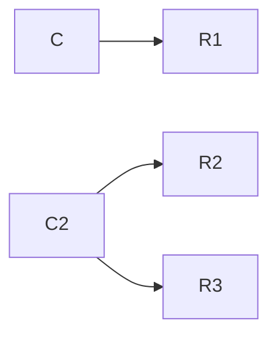
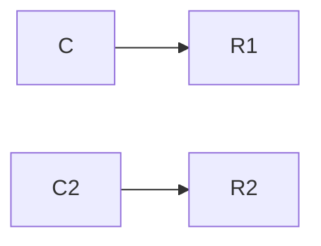

# Project 2

Your second project will require you to answer each of the 10 questions below.  You will be expected to open a pull request with your initial answers by the second class meeting, giving you one week to work on these problems. You and your peers will then have one week to work together to refine your respective initial answers, so they are ready for final submission. Once your pull requests have been reviewed and merged to the development branch, I will review them, then merge to the master branch. 

```
Tip #1: Carefully study the Baader, et. al. selections assigned on bisimulation; it is deceptively subtle, and quite powerful. 
Tip #2: Google is still your friend. So is stackexchange...
Tip #3: Work together to solve these problems, even for initial submissions and when you do, document this in github. 
Tip #4: Work together as a team. 
```

1. Let V be a vocabulary of ALCI consisting of a role name "P". Interpret part_of as "x is a part of y". Using this role name, define the following formulas in this language:
```
  (a)  PP that says that x is a proper part of y
  PP= ∃part_of^~∃part-of-
  (b)  iPP that says that y is a proper part of x
  iPP= ∃part_of-^~∃part-of
  (c)  iP that says that y has x as part
  ip= ∃part_of-
  (d)  O that says that x overlaps y
  O= ∃part_of^∃part_of-
  (e)  D that says that x and y are disjoint
  D= ∃~part_of^∃~part-of-
```

2. Use your axioms from question 1 as the basis of an ALCI T-Box. Supplement this T-box with whatever other axioms you like, as well as an A-box, so that you ultimately construct a knowledge base K = (T,A). Provide a _model_ of K. This may be graphical or symbolic or both. 
PP= ∃part_of^~∃part-of-

ipp= ∃part_of-^~∃part-of

ip= ∃part_of-

O= ∃part_of^∃part_of-

D= ∃~part_of^∃~part-of-

(Lazarus,x): PP

(Lazarus, City)

(City, y): Ipp

(Lazarus, City): Part_of

(City, Lazarus): Part_of

Proper part: Lazarus, City

overlaps: none

Disjoint: none

3. Translate the following first-order logic axioms into ALCI: 
```
(a) ∀x∃y∀z(R(x,y) ∧ R(x,z) ∧ R(y,z))
∃R.(∀R.(∀R¯.T))
(b) ∃x∀y∃z(R(x,y) ∧ R(x,z) ∧ R(y,z))
∃R¯.(∃R.(∃R¯.T))
(c) ∀y(R(x, y) → ∃x(R(y, x) ∧ ∀y(R(x, y) → A(y))))
∀R.∃R.∀R.A
(d) (∀y)(R(x, y) → A(y)) ∧ (∃y)(R(x, y) ∧ B(y))
(∀R.A)^(∃R.B)
```
4. Provide an interpretation I<sub>1</sub> for ALC and an interpretation I<sub>2</sub> for ALCN - each distinct from any interpretation covered in class so far - and construct a bisimulation that demonstrates ALCN is more expressive than ALC. Use the [mermaid syntax](https://github.com/mermaid-js/mermaid) of markdown to provide a graphical representation of your work. Feel free to use the [mermaid live editor](https://mermaid.live/) when diagramming. 

Interpretation: C=Candy

C^∃R.T 

C^>= 2R.t
```
```

```


5. Provide an interpretation I<sub>1</sub> for ALC and an interpretation I<sub>2</sub> for ALCN - each distinct from any interpretation covered in class so far - and construct a bisimulation that _does not_ demonstrate ALCN is more expressive than ALC. Use the [mermaid syntax](https://github.com/mermaid-js/mermaid) of markdown to provide a graphical representation of your work. Feel free to use the [mermaid live editor](https://mermaid.live/) when diagramming. 

Interpretation: C=Candy

C^∃R.T  

C^=1R.t
```
```
```

```


6. Explain the difference - using natural language - between the description logic expressions:
  ```
  (a) ∃r.C and ∀r.C
  The first is saying that there for all things such that they are x, there is something y which is an instance of C  which is r-related to it and the second says that for all things such that they are x, everything y which is an instance of c is r-related to it.
 (b) ∃r-.C and ∀r-.C
   The first is saying that there for all things such that they are x, there is something y which is an instance of C which is inversely r-related to it and the second says that for all things such that they are x, everything y which is an instance of c is inversely r-related to it.
  (c) <=nr and <=nr.C
  The first claims that for all things such that they are x, there are less than or equal to a n number of r successors. In the second part, it says that for all things such that they are x, there are less than or equal to n number of r successors which are instances of C.
  (d) ∃r-.C and ∃r-.{a} 
  The first claims that there is some instance of C which has an inverse r-relationship with all things such that they are x and the second claims that the singleton set of a includes an instance of something which bears an inverse r-relationship with all things such that they are x.
```

7. There is a delightfully helpful subreddit called "ELI5" which stands for something like "explain it like I'm 5" where users post conceptually challenging questions and other users attempt to provide explanations in simple, jargon-free, terms that presumably a 5 year-old could understand. Using this as a model, explain the _finite model property_. Be sure to provide a simple example and explain when the property might be important, and when it is not so important. 

The finite model property is a property of a system of logic (roughly a way of producing sentences which can be checked for truth or falsity or which can be used to systematically say certain things) where everything that can be said in that system (where that system does not go on forever) which isn't known for sure can be disproved with a certain interpretation of the system without having an infinite number of steps to do so. For example, a logic might have this property if we take the sentences "All parents have kids" and "All bachelors are unmarried" as known for sure within that system. In this system, we might get another sentence like "All bachelors do not have kids." If we can show that this sentence is false in a certain interpretation without having to make an infinite number of other claims and that this is the only other sentence not known for sure in the system, then this system will meet this property. In this case, we might interpret "bachelor" as a man or non-binary person who may or may not have been in a relationship in the past. This would mean that this sentence can be understood as false within this system, as being a bachelor does not prevent someone from having had a kid.

This is useful to know because it tells us whether we can know if any given sentence within a system can be true or false. If a system lacks that property, then there may be a sentence and interpretation which may not be true or false in a way we can determine. If it has that property, then we know that any sentence in that system will be either true or false and will know that we will have results if we try to prove it one way or another. If we care to know whether a specific system may be checkable for the truth or falsity of its parts, then we will be interested in this property. This may be due to concerns about checking a system efficiently, or for the sake of creating an ai based on the system so that it doesn't fall down a hole of infinitely checking one statement and interpretation. 

If not (such as in cases where the truth of falsity of involved claims does not matter for our interests), then we would not be interested in this property. This would be in cases where we are trying to represent issues where the truth of falsity of the claims are ambiguous or using a system of logic which allows for something to be neither true or false. Such systems, while not useful for some of the purposes that we have with the finite model property, could allow us to capture the realities of certain complicated issues or situations where the simplicity given by the finite model property would be misleading.

8. Following up on the preceding , explain the _tree model property_. Be sure to provide a simple example and explain when the property might be important, and when it is not so important. 

The Tree model property is a property of logic systems (again roughly a way of producing sentences which can be checked for truth or falsity or as a systematic way of expressing certain things). This property is about the way in which we can check certain sentences in that system for truth or falsity based on a specific interpretation of the system in question through the use of a "tree" model. 

A tree model is one where you start with a single part of the sentence and go down through branches until the sentence can be shown to be true of false. This may stop at some point or go on infinitely. For instance we may have an interpretation where we have the statements "Lemons are yellow" and "Anything that isn't a lemon is not yellow." We may wish to determine if the sentence "Apples are not lemons." With this system and sentence, we may test the last part by splitting off the parts of "apples" and "not lemons" from the whole statement. From there, we may continue doing the same technique until we find the sentence to be true or false.

This is useful to determine because the tree model is an easy way to determine a sentence's truth or falsity, and conveys something about the ability to determine the truth or falsity of the statements which can be said in a given system. If we want to determine whether or not this useful method is an option for checking this truth or falsity, we would be interested in whether or not it has the tree model property. This would help us understand the basic knowledge that anything which uses that system might have. 

If we do not wish to use this method, however, or if we are uninterested in the truth or falsity of the sentences which can be said in a system then we would not be interested in determining whether or not the system in question has the tree model property. This would occur if we were using systems of logic where we allow for statements to be neither true nor false and in situations where we face more complex statements than can be understood in a tree model. In the former case, a tree model would not help us to capture the complexities introduced by less definite truth or falsity. In the latter case, the statements we are interested in better understanding would not be helpfully understood through a tree model. In that latter case, we would want to look to other methods to either check truth or falsity or to better understand the overall status of the statements.

9. Open the Protege editor and create object properties for each of the role names that you constructed in question 1. You should have at least 6 object properties. Assert in the editor that P is a sub-property of O, that P is transitive, and that O is symmetric. Next, add individuals - a, b, c - to the file and assert that c is part of a and that c overlaps b. Running the reasoner should reveal - highlighted in yellow if you select the individual c - that c overlaps a. Using the discussion in the selections from chapter 4 of the Baader, et. al. text as a guide, explain how the tableau algorithm is generating this inference. Also, provide a screenshot of the results of your reasoner run with c highlighted. 

The tableau algorithm is generating this inference by looking to what is involved with the P (Part_of) relation as a sub-property of O (overlaps) where P is transitive and O is symmetric. Since P is transitive, if we have three connected individuals (x,y,z) where x is connected to y and y is connected to z, then x is also connected to z. This will carry parthood across several relationships. Since O is symmetric, this will mean that any two individuals where one has this property with the other will also have the other have this property with the one. P's status as a sub-property of O will then mean that any part_of relation will also constitute an overlapping relation. 

Given this, it knows that c is a part of a. Since c is a part of a this will then mean that c will also overlap with a since the part_of relation is a sub-property of the overlapping relation.
```


10. Following up on your work in question 9, adjust/add/remove/etc. object properties and individuals in your Protege file so that when you run a reasoner in Protege, you return the following consequences: 
```
  (a) a is a proper part of b and disjoint from e
  (b) a overlaps c
  (c) a is part of b, b is part of f, and a is part of f
  (e) There are no parts between a and g in common
```
Provide a screenshot of your results here. 


