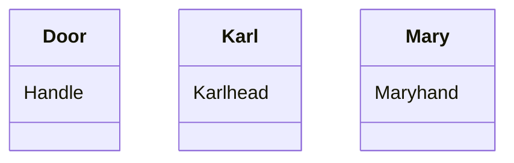
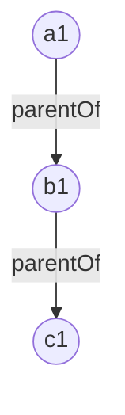
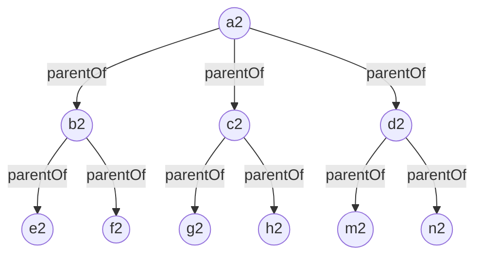
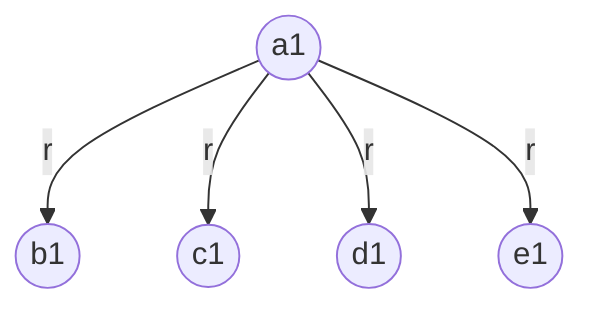
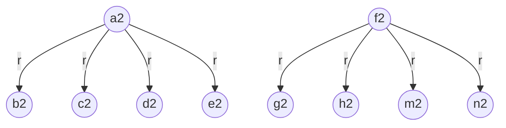
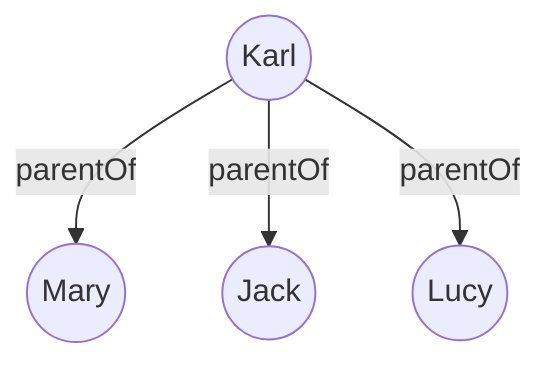

# Project 2

Your second project will require you to answer each of the 10 questions below.  You will be expected to open a pull request with your initial answers by the second class meeting, giving you one week to work on these problems. You and your peers will then have one week to work together to refine your respective initial answers, so they are ready for final submission. Once your pull requests have been reviewed and merged to the development branch, I will review them, then merge to the master branch. 

```
Tip #1: Carefully study the Baader, et. al. selections assigned on bisimulation; it is deceptively subtle, and quite powerful. 
Tip #2: Google is still your friend. So is stackexchange...
Tip #3: Work together to solve these problems, even for initial submissions and when you do, document this in github. 
Tip #4: Work together as a team. 
```

**[1]** Let V be a vocabulary of ALCI consisting of a role name "P". Interpret part_of as "x is a part of y". Using this role name, define the following formulas in this language:
```
  (a)  PP that says that x is a proper part of y
  (b)  iPP that says that y is a proper part of x
  (c)  iP that says that x has y as part 
  (d)  O that says that x overlaps y
  (e)  D that says that x and y are disjoint 
```

Answer:

(a) $PP ≡ P\sqcap ¬P^-$

(b) $iPP ≡ P^-\sqcap ¬P$

(c) $iP ≡ P^-$

(d) $O ≡ ∃P^-.(∃P.\top)$

(e) $D ≡  ∀P^-.(∀P.\bot)$

**[2]** Use your axioms from question 1 as the basis of an ALCI T-Box. Supplement this T-box with whatever other axioms you like, as well as an A-box, so that you ultimately construct a knowledge base K = (T,A). Provide a _model_ of K. This may be graphical or symbolic or both. 

Answer:

K = (T,A) such that

T={PP ≡ P ⊔ ¬P<sup>-</sup>,

$iPP ≡ P^-\sqcap ¬P$,

$iP ≡ P^-$,

$O ≡ ∃P^-.(∃P.\top)$,

$D ≡  ∀P^-.(∀P.\bot)$,

$TP (partOfPartof) ≡ P.(P)$,

$SI (selfIdenticalTo) ≡ P\sqcap P^-$}

A={(Handle,Door):P, (Karl,Mary):D, (Karlhead,Karl):P, (Maryhand,Mary):P}


The following is a model $\Im=(\bigtriangleup^\Im,.^\Im)$ of K:

$\bigtriangleup^\Im$={a,b,c,d,e,f}

$P^\Im$={(a,b), (e,c), (f,d),(a,a),(b,b),(c,c),(d,d),(e,e),(f,f)}

$P¯^\Im$={(b,a), (c,e), (d,f),(a,a),(b,b),(c,c),(d,d),(e,e),(f,f)}

$PP^\Im$={(a,b), (e,c), (f,d)}

$iPP^\Im$={(b,a), (c,e), (d,f)}

$iP^\Im$={(b,a), (c,e), (d,f),(a,a),(b,b),(c,c),(d,d),(e,e),(f,f)}

$O^\Im$={(a,b), (e,c), (f,d),(b,a), (c,e), (d,f)}

$D^\Im$={(c,d), (d,c), (b,c), (c,b), (b,d), (d,b), (a,e),(e,a),(a,f),(f,a),(e,f),(f,e),(a,c),(c,a),(a,d),(d,a),(b,e),(e,b),(d,e),(e,d),(b,f),(f,b),(c,f),(f,c)}

$TP^\Im$=$\emptyset$

$SI^\Im$={(a,a),(b,b),(c,c),(d,d),(e,e),(f,f)}


$Handle^\Im$={a}

$Door^\Im$={b}

$Karl^\Im$={c}

$Mary^\Im$={d}

$Karlhead^\Im$={e}

$Maryhand^\Im$={f}


This model seems very complex at first glance, but it is actually intuitive: Imagine two persons Karl and Mary, and a door called "Door". Karl has a head called "Karlhead", Mary has a hand called "Maryhand", and Door has a handle called "Handle". My model is designed to describe in detail mereological relations between them.



**[3]** Translate the following first-order logic axioms into ALCI: 
```
(a) ∀x∃y∀z(R(x,y) ∧ R(x,z) ∧ R(y,z))
(b) ∃x∀y∃z(R(x,y) ∧ R(x,z) ∧ R(y,z))
(c) ∀y(R(x, y) → ∃x(R(y, x) ∧ ∀y(R(x, y) → A(y))))
(d) (∀y)(R(x, y) → A(y)) ∧ (∃y)(R(x, y) ∧ B(y))
```

Answer:

(a) $∃R.(∀R.\top)\sqcap ∀R.\top$

(b) $∃R.T \sqcap ∃R^-.(∃R.T)$

(c) $∀R.(∃R.(∀R.A))$

(d) $∀R.A\sqcap∃R.B$

**[4]** Provide an interpretation I<sub>1</sub> for ALC and an interpretation I<sub>2</sub> for ALCN - each distinct from any interpretation covered in class so far - and construct a bisimulation that demonstrates ALCN is more expressive than ALC. Use the [mermaid syntax](https://github.com/mermaid-js/mermaid) of markdown to provide a graphical representation of your work. Feel free to use the [mermaid live editor](https://mermaid.live/) when diagramming. 

Answer: 

Let $I_1=(\bigtriangleup^1,.^1)$ is an interpretation for ALC such that:

$\bigtriangleup$<sup>I<sub>1<sub></sup>={a1,b1,c1}

parentOf<sup>I<sub>1<sub></sup> = {(a1,b1),(b1,c1)}



Let $I_2=(\bigtriangleup^2,.^2)$ is an interpretation for ALCN such that:

$\bigtriangleup$<sup>I<sub>2<sub></sup>={a2,b2,c2,d2,e2,f2,g2,h2,m2,n2}

parentOf<sup>I<sub>1<sub></sup> = {(a2,b2),(a2,c2),(a2,d2),(b2,e2),(b2,f2),(c2,g2),(c2,h2),(d2,m2),(d2,n2)}



It is clear that $p$ = {(a1,a2),(b1,b2),(b1,c2),(b1,d2),(c1,e2),(c1,f2),(c1,g2),(c1,h2),(c1,m2),(c1,n2)} is a bisimulation between $I_1$ and $I_2$, so we have ($I_1$, a1)~($I_2$, a2). However, $a2\in(\ge3 parentOf.(\ge2 parentOf))$<sup>I<sub>2<sub></sup>, but $a1\notin(\ge3 parentOf.(\ge2 parentOf))$<sup>I<sub>1<sub></sup>, so $(\ge3 parentOf.(\ge2 parentOf))$ is not a ALC concept (otherwise it should be the case that $a1\in(\ge3 parentOf.(\ge2 parentOf))$<sup>I<sub>1<sub></sup>). Therefore, we find that a ALCN concept which is not ALC concept, showing that ALCN is more expressive than ALC.

**[5]** Provide an interpretation I<sub>1</sub> for ALC and an interpretation I<sub>2</sub> for ALCN - each distinct from any interpretation covered in class so far - and construct a bisimulation that _does not_ demonstrate ALCN is more expressive than ALC. Use the [mermaid syntax](https://github.com/mermaid-js/mermaid) of markdown to provide a graphical representation of your work. Feel free to use the [mermaid live editor](https://mermaid.live/) when diagramming. 

Answer:

Let $I_1=(\bigtriangleup^1,.^1)$ is an interpretation for ALC such that:

$\bigtriangleup$<sup>I<sub>1<sub></sup>={a1,b1,c1,d1,e1}

r<sup>I<sub>1<sub></sup> = {(a1,b1),(a1,c1),(a1,d1),(a1,e1)}



Let $I_2=(\bigtriangleup^2,.^2)$ is an interpretation for ALCN such that:

$\bigtriangleup$<sup>I<sub>1<sub></sup>={a2,b2,c2,d2,e2,f2,g2,h2,m2,n2}

r<sup>I<sub>1<sub></sup> = {(a2,b2),(a2,c2),(a2,d2),(a2,e2),(f2,g2),(f2,h2),(f2,m2),(f2,n2)}



It is clear that $p$ = {(a1,a2),(b1,b2),(c1,c2),(d1,d2),(e1,e2),(a1,f2),(b1,g2),(c1,h2),(d1,m2),(e1,n2)} is a bisimulation between $I_1$ and $I_2$. But $I_1$ and $I_2$ _does not_ demonstrate ALCN is more expressive than ALC because these two interpretations are isomorphic.


**[6]** Explain the difference - using natural language - between the description logic expressions:
  ```
  (a) ∃r.C and ∀r.C
  (b) ∃r-.C and ∀r-.C
  (c) <=nr and <=nr.C
  (d) ∃r-.C and ∃r-.{a} 
```

Answer:

(a) ∃r.C means that x has a r-filler which is an instance of C; and ∀r.C means that x's all r-fillers are instances of C.

(b) ∃r-.C means that x has a r-predecessor which is an instance of C; and ∀r-.C means x's all r-predecessors are instances of C.

(c) <=nr means that x has at most $n$ r-fillers; and <=nr.C means that x has at most $n$ r-fillers instantiating C.

(d) ∃r-.C means that x has a r-predecessor which is an instance of C; and ∃r-.{a} means that x has a r-predecessor which is $a$.

**[7]** There is a delightfully helpful subreddit called "ELI5" which stands for something like "explain it like I'm 5" where users post conceptually challenging questions and other users attempt to provide explanations in simple, jargon-free, terms that presumably a 5 year-old could understand. Using this as a model, explain the _finite model property_. Be sure to provide a simple example and explain when the property might be important, and when it is not so important. 

Answer:

(1) When we say that a concept like "Dog" is satisfiable in a description logic, we mean that there is a model to assign some individual dogs to it. Now if every satisfiable concept in that description logic has a finite model, a model which has only finitely many elements, then we say that logic has _finite model property_.

(2) Example: Consider a simple _ALC_ T-box T<sup>1</sup>={$Dog\sqsubseteq Mammal$, $Person\equiv Rational\sqcap Mammal$}. The _ALC_ concept $Spider$ is satisfiable with respect to T<sup>1</sup>, and it is not difficult to find that $Spider$ has a finite model with respect to T<sup>1</sup>. For example, $I_1=(\bigtriangleup^1,.^1)$ such that:

$\bigtriangleup^1$={a,b,c,d}

$Dog^1$ = {b,c}

$Mammal^1$ = {a,b,c}

$Person^1$= {a}

$Rational^1$= {a}

$Spider^1$= {d}

It is clear that $I_1$ is a model of T<sup>1</sup>, and $Spider$ has an instance _d_ in $I_1$. So $I_1$ is a finite model of $Spider$ with respect to T<sup>1</sup>.

(3) Finite model property (FMP) of a description logic is very important if we wanna design a decidable algorithm for the satisfiability of its concepts, and thus determine a conceptual hierarchy of that logic. But if we want a more expressive description logic like _ALCIN_, then FMP can be sacrified for its expressive power. Also, sometimes we are required to check the consistency of some knowledge base. In that case, FMP is not very useful because that knowledge base may not have a finite model. 

**[8]** Following up on the preceding , explain the _tree model property_. Be sure to provide a simple example and explain when the property might be important, and when it is not so important. 

Answer:

(1) When we say that a concept like "Father" is satisfiable in a description logic, we mean that there is a model to assign some individual men to it. Now if every satisfiable concept in that description logic has a tree model, then we say that logic has _tree model property_. Here a model is a _tree model_ if it can be represented as a tree-like graph, which has only one root, viz. a node without parent, and every child node below the root has only one parent. 

(2) Consider a simple _ALC_ T-box T<sup>2</sup>={$Daughter\sqsubseteq Female$, $Son \sqsubseteq Male$}. The _ALC_ concept $Father$ is satisfiable with respect to T<sup>2</sup>, and it is not difficult to find that $Father$ has a tree model with respect to T<sup>2</sup>. For example, $I_2=(\bigtriangleup^2,.^2)$ such that:

$\bigtriangleup^2$={Karl,Mary,Jack,Lucy}

$Daughter^2$ = {Mary,Lucy}

$Female^2$ = {Mary,Lucy}

$Son^2$= {Jack}

$Male^2$= {Karl,Jack}

$Father^2$= {Karl}

$parentOf^2$ = {(Karl,Mary),(Karl,Jack),(Karl,Lucy)}


It is clear that $I_2$ is a model of T<sup>2</sup>, and $Father$ has an instance _Karl_ in $I_2$. And $I_2$ is a tree model of $Father$ with respect to T<sup>2</sup>.

(3) TMP is crucial to tableau-based algorithms for the consistency check of knowledge base and applied ontology. Most of applied ontologies, especially those BFO-based ones, have TMP, allowing that their consistency can be checked by tableau reasonings. Moreover, TMP can show decidability of satisfiability of ALC concepts in the so-called automata-based approach.

However, if we deal with linear roles or small datasets, TMP might not be very useful because its poor generalization performance in these cases.

**[9]** Open the Protege editor and create object properties for each of the role names that you constructed in question 1. You should have at least 6 object properties. Assert in the editor that P is a sub-property of O, that P is transitive, and that O is symmetric. Next, add individuals - a, b, c - to the file and assert that c is part of a and that c overlaps b. Running the reasoner should reveal - highlighted in yellow if you select the individual c - that c overlaps a. Using the discussion in the selections from chapter 4 of the Baader, et. al. text as a guide, explain how the tableau algorithm is generating this inference. Also, provide a screenshot of the results of your reasoner run with c highlighted. 

Answer:

 


The tableau algorithm generates this inference (c,a):O in such a way:

From Theorem 2.17 (Baader.etc: 32), we have $(\emptyset,A)\models(c,a):O$ iff ($\emptyset,A\cup$ {(c,a):¬O}) _is_ not consistent. Here A={(c,a):P,(c,b):O}.

Therefore, the target inference problem becomes the problem of determining that the new A-box A*={(c,a):P,(c,b):O, (c,a)¬O} is inconsistent.

In order to calculate with the inconsistency problem, the algorithm _expand_ will first apply concept expansion rules to A* to construct a complete A-box. However, as we notice, A* does not include any concept, so the application of expansion rules to A* is empty. 

However, by the fact that P is a sub-property of O and that (c,a):P, the algorithm _expand_ infers that (c,a):O, and thus finds that A* implies a clash {(c,a):O, (c,a):¬O}. Thus, $expand(A^*)= \emptyset$. 

In light of this, a larger alrorithm _consistent_ which includes the algorithm _expand_ will return "inconsistent". Given Theorem 2.17, we have shown that $(\emptyset,A)\models(c,a):O$.

**[10]**  Following up on your work in question 9, adjust/add/remove/etc. object properties and individuals in your Protege file so that when you run a reasoner in Protege, you return the following consequences: 
```
  (a) a is a proper part of b and disjoint from e
  (b) a overlaps c
  (c) a is part of b, b is part of f, and a is part of f
  (e) There are no parts between a and g in common
```

Provide a screenshot of your results here. 

Answers:

 

 

 
