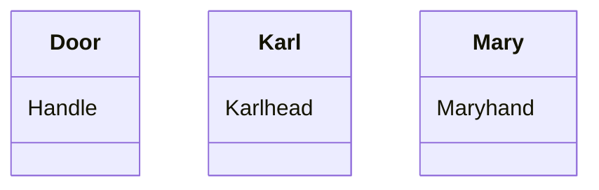

# Project 2

Your second project will require you to answer each of the 10 questions below.  You will be expected to open a pull request with your initial answers by the second class meeting, giving you one week to work on these problems. You and your peers will then have one week to work together to refine your respective initial answers, so they are ready for final submission. Once your pull requests have been reviewed and merged to the development branch, I will review them, then merge to the master branch. 

```
Tip #1: Carefully study the Baader, et. al. selections assigned on bisimulation; it is deceptively subtle, and quite powerful. 
Tip #2: Google is still your friend. So is stackexchange...
Tip #3: Work together to solve these problems, even for initial submissions and when you do, document this in github. 
Tip #4: Work together as a team. 
```

[1] Let V be a vocabulary of ALCI consisting of a role name "P". Interpret part_of as "x is a part of y". Using this role name, define the following formulas in this language:
```
  (a)  PP that says that x is a proper part of y
  (b)  iPP that says that y is a proper part of x
  (c)  iP that says that y has x as part 
  (d)  O that says that x overlaps y
  (e)  D that says that x and y are disjoint 
```

Answer:

(a) $PP ≡ P\sqcap ¬P^-$

(b) $iPP ≡ P^-\sqcap ¬P$

(c) $iP ≡ P$

(d) $O ≡ ∃P^-.(∃P.\top)$

(e) $D ≡  ∀P^-.(∀P.\bot)$

[2] Use your axioms from question 1 as the basis of an ALCI T-Box. Supplement this T-box with whatever other axioms you like, as well as an A-box, so that you ultimately construct a knowledge base K = (T,A). Provide a _model_ of K. This may be graphical or symbolic or both. 

Answer:

K = (T,A) such that

T={$PP ≡ P\sqcap ¬P^-$,

$iPP ≡ P^-\sqcap ¬P$,

$iP ≡ P$,

$O ≡ ∃P^-.(∃P.\top)$,

$D ≡  ∀P^-.(∀P.\bot)$,

$TP (partOfPartof) ≡ P.(P)$,

$SI (selfIdenticalTo) ≡ P\sqcap P^-$}

A={(Handle,Door):P, (Karl,Mary):D, (Karlhead,Karl):P, (Maryhand,Mary):P}


The following is a model $\Im=(\bigtriangleup^\Im,.^\Im)$ of K:

$\bigtriangleup^\Im$={a,b,c,d,e,f}

$P^\Im$={(a,b), (e,c), (f,d),(a,a),(b,b),(c,c),(d,d),(e,e),(f,f)}

$P¯^\Im$={(b,a), (c,e), (d,f),(a,a),(b,b),(c,c),(d,d),(e,e),(f,f)}

$PP^\Im$={(a,b), (e,c), (f,d)}

$iPP^\Im$={(b,a), (c,e), (d,f)}

$iP^\Im$={(a,b), (e,c), (f,d),(a,a),(b,b),(c,c),(d,d),(e,e),(f,f)}

$O^\Im$={(a,b), (e,c), (f,d),(b,a), (c,e), (d,f)}

$D^\Im$={(c,d), (d,c), (b,c), (c,b), (b,d), (d,b), (a,e),(e,a),(a,f),(f,a),(e,f),(f,e),(a,c),(c,a),(a,d),(d,a),(b,e),(e,b),(d,e),(e,d),(b,f),(f,b),(c,f),(f,c)}

$TP^\Im$=$\emptyset$

$SI^\Im$={(a,a),(b,b),(c,c),(d,d),(e,e),(f,f)}


$Handle^\Im$={a}

$Door^\Im$={b}

$Karl^\Im$={c}

$Mary^\Im$={d}

$Karlhead^\Im$={e}

$Maryhand^\Im$={f}


This model seems very complex at first glance, but it is actually intuitive: Imagine two persons Karl and Mary, and a door called "Door". Karl has a head called "Karlhead", Mary has a hand called "Maryhand", and Door has a handle called "Handle". My model is designed to describe in detail mereological relations between them.


[3] Translate the following first-order logic axioms into ALCI: 
```
(a) ∀x∃y∀z(R(x,y) ∧ R(x,z) ∧ R(y,z))
(b) ∃x∀y∃z(R(x,y) ∧ R(x,z) ∧ R(y,z))
(c) ∀y(R(x, y) → ∃x(R(y, x) ∧ ∀y(R(x, y) → A(y))))
(d) (∀y)(R(x, y) → A(y)) ∧ (∃y)(R(x, y) ∧ B(y))
```

Answer:

(a)  

(b) 

(c) $∀R.(∃R^-.(∀R.A))$

(d) $∀R.A\sqcap∃R.B$

[4] Provide an interpretation I<sub>1</sub> for ALC and an interpretation I<sub>2</sub> for ALCN - each distinct from any interpretation covered in class so far - and construct a bisimulation that demonstrates ALCN is more expressive than ALC. Use the [mermaid syntax](https://github.com/mermaid-js/mermaid) of markdown to provide a graphical representation of your work. Feel free to use the [mermaid live editor](https://mermaid.live/) when diagramming. 

[5] Provide an interpretation I<sub>1</sub> for ALC and an interpretation I<sub>2</sub> for ALCN - each distinct from any interpretation covered in class so far - and construct a bisimulation that _does not_ demonstrate ALCN is more expressive than ALC. Use the [mermaid syntax](https://github.com/mermaid-js/mermaid) of markdown to provide a graphical representation of your work. Feel free to use the [mermaid live editor](https://mermaid.live/) when diagramming. 


[6] Explain the difference - using natural language - between the description logic expressions:
  ```
  (a) ∃r.C and ∀r.C
  (b) ∃r-.C and ∀r-.C
  (c) <=nr and <=nr.C
  (d) ∃r-.C and ∃r-.{a} 
```

Answer:

(a) ∃r.C means that x has a r-filler which is an instance of C; and ∀r.C means that x's all r-fillers are instances of C.

(b) ∃r-.C means that x has a r-predecessor which is an instance of C; and ∀r-.C means x's all r-predecessors are instances of C.

(c) <=nr means that x has at most $n$ r-fillers; and <=nr.C means that x has at most $n$ r-fillers instantiating C.

(d) ∃r-.C means that x has a r-predecessor which is an instance of C; and ∃r-.{a} means that x has a r-predecessor which is $a$.

[7] There is a delightfully helpful subreddit called "ELI5" which stands for something like "explain it like I'm 5" where users post conceptually challenging questions and other users attempt to provide explanations in simple, jargon-free, terms that presumably a 5 year-old could understand. Using this as a model, explain the _finite model property_. Be sure to provide a simple example and explain when the property might be important, and when it is not so important. 

[8] Following up on the preceding , explain the _tree model property_. Be sure to provide a simple example and explain when the property might be important, and when it is not so important. 

[9] Open the Protege editor and create object properties for each of the role names that you constructed in question 1. You should have at least 6 object properties. Assert in the editor that P is a sub-property of O, that P is transitive, and that O is symmetric. Next, add individuals - a, b, c - to the file and assert that c is part of a and that c overlaps b. Running the reasoner should reveal - highlighted in yellow if you select the individual c - that c overlaps a. Using the discussion in the selections from chapter 4 of the Baader, et. al. text as a guide, explain how the tableau algorithm is generating this inference. Also, provide a screenshot of the results of your reasoner run with c highlighted. 

[10]  Following up on your work in question 9, adjust/add/remove/etc. object properties and individuals in your Protege file so that when you run a reasoner in Protege, you return the following consequences: 
```
  (a) a is a proper part of b and disjoint from e
  (b) a overlaps c
  (c) a is part of b, b is part of f, and a is part of f
  (e) There are no parts between a and g in common
```
Provide a screenshot of your results here. 
