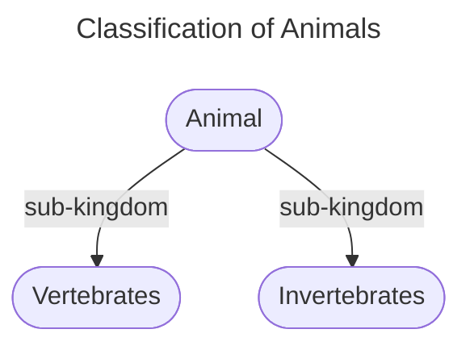

# Project 2

Your second project will require you to answer each of the 10 questions below.  You will be expected to open a pull request with your initial answers by the second class meeting, giving you one week to work on these problems. You and your peers will then have one week to work together to refine your respective initial answers, so they are ready for final submission. Once your pull requests have been reviewed and merged to the development branch, I will review them, then merge to the master branch. 

```
Tip #1: Carefully study the Baader, et. al. selections assigned on bisimulation; it is deceptively subtle, and quite powerful. 
Tip #2: Google is still your friend. So is stackexchange...
Tip #3: Work together to solve these problems, even for initial submissions and when you do, document this in github. 
Tip #4: Work together as a team. 
```

1. Let V be a vocabulary of ALCI consisting of a role name "P". Interpret part_of as "x is a part of y". Using this role name, define the following formulas in this language:

  (a)  PP that says that x is a proper part of y
  
  Answer:
  PP ≡ P ⊓ ¬P¯
  
  (b)  iPP that says that y is a proper part of x
 
  Answer:
  iPP ≡ (P ⊓ ¬P¯)¯
  
  (c)  iP that says that y has x as part 
  
  Answer:
  iP ≡ P¯
  
  (d)  O that says that x overlaps y
  
  Answer:
  O ≡ ∃P¯.(∃P)
  
  (e)  D that says that x and y are disjoint 
  
  Answer:
  D ≡ ¬O

2. Use your axioms from question 1 as the basis of an ALCI T-Box. Supplement this T-box with whatever other axioms you like, as well as an A-box, so that you ultimately construct a knowledge base K = (T,A). Provide a _model_ of K. This may be graphical or symbolic or both. 

Answer: 

A mode I of K = (T#1, A#1) as follow,

ΔI = {Aquatic animal, Whales, Mammal, Cats, Seagull, Fish},
Aquatic animals = a,
Seagull = b,
Cats = c,
Fish = f,
Mammal = m,
Whales = w,
Fly = {b},
}

TBox: 
T#1 = {C ≡ Fly ⊔ ¬ Fly,
PP ≡ ≡ P ⊓ ¬P¯,
iPP ≡ iPP ≡ (P ⊓ ¬P¯)¯,
iP ≡ P¯
O ≡ ∃P¯.(∃P)
D ≡ ¬O
}

ABox:
A#1 = { 
Fly: b,
PP(w, a),
pp(w, m),
pp(f, a),
iP (m, w),
iPP (m, c),
O (a, m),
D(f,m),
D(b, c),
D(a, b)
}


3. Translate the following first-order logic axioms into ALCI: 

(a) ∀x∃y∀z(R(x,y) ∧ R(x,z) ∧ R(y,z))

Answer: ∃R.(∀R.T) ⊓ ∀R.T

(b) ∃x∀y∃z(R(x,y) ∧ R(x,z) ∧ R(y,z))

Answer: ∃r.(∃r.C ∧ ∀r¯.C)
∃R¯.(∃R.⊤) ⊓ ∃R.⊤


(c) ∀y(R(x, y) → ∃x(R(y, x) ∧ ∀y(R(x, y) → A(y))))

Answer: ∃r.(∃r.C ∧ ∀r¯.C)

(d) (∀y)(R(x, y) → A(y)) ∧ (∃y)(R(x, y) ∧ B(y))


4. Provide an interpretation I<sub>1</sub> for ALC and an interpretation I<sub>2</sub> for ALCN - each distinct from any interpretation covered in class so far - and construct a bisimulation that demonstrates ALCN is more expressive than ALC. Use the [mermaid syntax](https://github.com/mermaid-js/mermaid) of markdown to provide a graphical representation of your work. Feel free to use the [mermaid live editor](https://mermaid.live/) when diagramming. 

---
I<sub>1</sub>
---

---
I<sub>2</sub> 
---


5. Provide an interpretation I<sub>1</sub> for ALC and an interpretation I<sub>2</sub> for ALCN - each distinct from any interpretation covered in class so far - and construct a bisimulation that _does not_ demonstrate ALCN is more expressive than ALC. Use the [mermaid syntax](https://github.com/mermaid-js/mermaid) of markdown to provide a graphical representation of your work. Feel free to use the [mermaid live editor](https://mermaid.live/) when diagramming. 

---
I<sub>1</sub>
---

---
I<sub>2</sub> 
---


6. Explain the difference - using natural language - between the description logic expressions:
 
  (a) ∃r.C and ∀r.C
  
  Answer: ∃r.C means that there exists a r-filler which is an element that belongs to C, while ∀r.C means that all r-fillers are Cs.
  
  (b) ∃r-.C and ∀r-.C
  
  Answer: ∃r-.C means that there exists a inverse r-filler which an element that belongs to C, while ∀r.C means that all inverse r-fillers are Cs.
  
  (c) <=nr and <=nr.C
  
  Answer: <=nr means that there are no more than n r-fillers, while <=nr.C means that there are no more than n r-fillers in C.
  
  (d) ∃r-.C and ∃r-.{a} 
  
  Answer: ∃r-.C means that there are no more than n inverse r-fillers, while <=nr.C means that there are no more than n inverse r-fillers in C.


7. There is a delightfully helpful subreddit called "ELI5" which stands for something like "explain it like I'm 5" where users post conceptually challenging questions and other users attempt to provide explanations in simple, jargon-free, terms that presumably a 5 year-old could understand. Using this as a model, explain the _finite model property_. Be sure to provide a simple example and explain when the property might be important, and when it is not so important. 

Ansewr: 
Bob loves playing games, and he hopes there is a game that can be played with different results forever. 
One day, his father gives him a game, called Color-card: there are a number of color cards in a box. Each card has a different color, but it is full colored on one side, while on the other side it is a blank sheet with the colored dot. Once a time, the player chooses any number of cards from the box, and then use any number of cards he chose to make combinations. For example, the first time, Bob chooses five color cards from the box, red, yellow, blue, green, brown, then he uses three cards, and put them in such a order: 1, red (front side), 2, blue (back side), 3, green (back side). That is one combination. The player continues playing until there is a combination that repeats. If the player cannot continue playing, he/she fails. 
However, if the player fails at one time, he/she can choose more or different cards, then plays the next time. The player wins if the cards he chooses can allow him to play forever. 
Unfortunately, Bob cannot win the game, because no matter how many cards he chooses (the number of cards is not limitless), and how hard he tries, he cannot continue playing without a repeated combination occur.  
We say that the Color-card game has finite model property. 

8. Following up on the preceding , explain the _tree model property_. Be sure to provide a simple example and explain when the property might be important, and when it is not so important. 

At another day, Bob's father gives him a different game, called Dot-and-Line. 
There is a big board, a number of tacks and thread. The games can be played with two people. When it is your turn, the other player choose a number of tacks and tacks them on the board - he/she can choose any place to locate a tack. Then the player uses thread to connect the tacks (any one tack needs to be connected to at least one other tack) - have all tacks to be connected. The connection is such that from one tack to any other tack through the thread, there is only one way to go. If the other player finds there is another way, you lose. If you does not lose, then it is the other player's turn. You two play on turn until one lose. 
We say that the Dot-and-Line game has the tree model property. 

9. Open the Protege editor and create object properties for each of the role names that you constructed in question 1. You should have at least 6 object properties. Assert in the editor that P is a sub-property of O, that P is transitive, and that O is symmetric. Next, add individuals - a, b, c - to the file and assert that c is part of a and that c overlaps b. Running the reasoner should reveal - highlighted in yellow if you select the individual c - that c overlaps a. Using the discussion in the selections from chapter 4 of the Baader, et. al. text as a guide, explain how the tableau algorithm is generating this inference. Also, provide a screenshot of the results of your reasoner run with c highlighted. 

10. Following up on your work in question 9, adjust/add/remove/etc. object properties and individuals in your Protege file so that when you run a reasoner in Protege, you return the following consequences: 
```
  (a) a is a proper part of b and disjoint from e
  (b) a overlaps c
  (c) a is part of b, b is part of f, and a is part of f
  (e) There are no parts between a and g in common
```
Provide a screenshot of your results here. 


