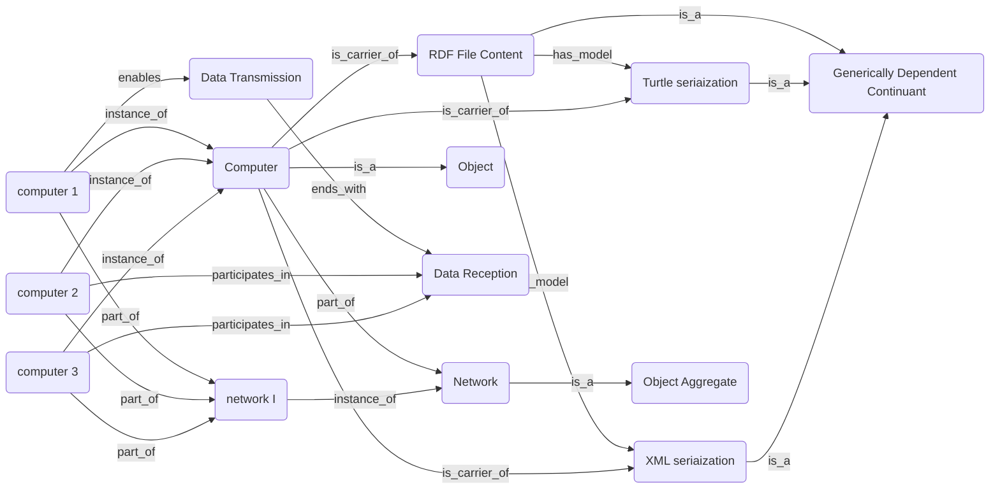
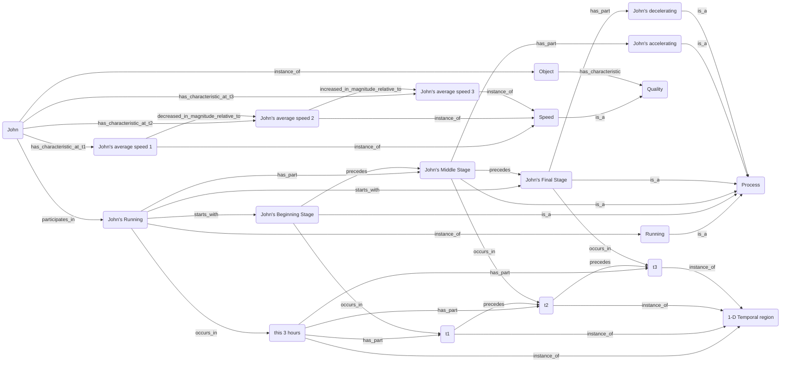

# Karl Project 3

Your third project will require you to answer each of the 10 questions below.  You will be expected to open a pull request with your initial answers by the second class meeting, giving you one week to work on these problems. You and your peers will then have one week to work together to refine your respective initial answers, so they are ready for final submission. Once your pull requests have been reviewed and merged to the development branch, I will review them, then merge to the master branch. 

```
For any question involving the use of Protege, please be sure to import Basic Formal Ontology (https://raw.githubusercontent.com/BFO-ontology/BFO/v2019-08-26/bfo_classes_only.owl) and the Relations Ontology (https://raw.githubusercontent.com/oborel/obo-relations/master/ro.owl)
```

**[1]** In BFO and RO identify at least one object property for each of a-e that _should have the listed property, but which does not_; argue for your case, using examples. 
```
  (a)  Reflexive
  (b)  Transitive 
  (c)  Symmetric
  (d)  Functional
  (e)  Symmetric and Reflexive
```

**Answer:**

(a) Object properties **"simultaneous with", "has part", "part of", "overlaps" and so on** should be reflexive, though it is not listed as so. For example, an event can be simultaneous with itself; also, an entity has_part, part_of, or overlaps itself because it is equivalent to itself.

(b) The object property **"determined by"** should be transitive, though it is not listed as so. That is, if A is determined by B, and B is determined by C, then A should be determined by C. For example, a small-size ecological cycle is determined by a biological host, say, a human being, that is, as a system at another level of granularity, is determined by his brain. In this case, we can say that the ecological cycle is determined by the human being's brain because its proper functioning leads the human to make efforts in maintaining that cycle. 

(c) The object property **"biotically interacts with"** should be symmetric, though it is not listed as so. If an organism A biotically interacts with another organism B, then it is clear that B is also biotically interacts with A. 

Similarly, **"participates in a biotic-biotic interaction with", "ecologically co-occurs with", "partially overlap" and so on** should also be symmetric.

(d) The object property **"has skeleton"** should be functional, though it is not listed as so. According to its definition, "has skeleton" is a relation between a segment or subdivision of an organism and the maximal subdivision of material entities that provides structural support for that segment or subdivision. Given that the maximal subdivision of material entities for any organism has only one, this object property is thereby functional.

(e) The object property **"overlaps"** should be both symmetric and reflexive, though it is not listed as so. First, if A overlaps B, then A and B has some common part. So B and A has also some common part, and thus B overlaps A. That is, overlapping is symmetric. Second, an entity can overlap itself because it clearly has the same parts with itself. Therefore, overlapping is also reflexive.

Similarly, **"spatially coextensive with" and "simultaneous with"** is also symmetric and reflexive.

**[2]** In BFO and RO identify at least one object property for each of a-e that _should not have the listed property, but which does_; argue for your case, using examples. 
```
  (a)  Irreflexive
  (b)  Transitive 
  (c)  Asymmetric
  (d)  Functional 
  (e)  Inverse Functional
```

**Answer:**

(a) Although **"has substance added"** is listed as irreflexive, but it should not be so. That is, in some cases, a physical entity can have itself as substance added to it. For example, a portion of water can be added to itself at some time. Similarly, **"has substance removed"** should not be irreflexive, either because we can always remove the same amount of water from itself.

(b) Although **"aligned with"** is listed as transitive, but it should not be so. Suppose that we have three different quadrilateral objects A, B, and C. A is aligned with B because of their alighed long sides, and B is aligned with C because of their aligned short sides, but A is not thus aligned with C because neither their long nor short sides are not aligned with each other.

Another funny example: Although **"end after"** is listed as transitive, but it should not be so. A possible counterexample can be found in a spacetime circle: The event of Jack's killing his grandfather ends after the event of his shooting, and the latter ends after the event of his returning to the past. However, the event of Jack's killing his grandfather does not end after the event of his returning to the past. Similarly, **"before"** should not be transitive, either. *(paradox of time travel)*

(c) Although **"has role in modeling" (or "is used to study")** is listed as asymmetric, but it should not be so. Suppose we wanna study the relation between a biological organism, say, a dog, and its biological niche. Given the mutual dependence between them in some plausible sense, it seems that the dog has role in modeling its niche, but its niche has also role in modeling it.

(d) Although **"phenotype of"** is listed as functional, but it should not be so. When we say an object property between a subject and an object is functional, we mean that a subject is related to only one object via that property. However, it seems that a particular skin color can be a phenotype of more than one human beings, so "phenotype of" is not functional.

(e) Although **"has characteristic"** is listed as inverse functional, but it should not be so. When we say an object property between a subject and an object is inverse functional, we mean that an object is related to only one subject via that property. Indeed, only an entity has_characteristic some trope property (e.g., this redness). However, it seems that multiple entities of the same type (e.g. apples) can all have_characteristic some universal (e.g. redness). So "has characteristic" should not be inverse functional if it applies to universals. 

**[3]** Model the following natural language expressions using terms from BFO and RO; you are welcome to introduce new terms where needed:  
```
  (a) Sally has an arm Tuesday but does not have an arm Wednesday. 
  (b) Every liver has some cell as part at all times it exists.
  (c) John was a child, then an adult, then a senior. 
  (d) Goofus and Gallant are married at each point in a three year span. 
```

**Answer:**

(a) Sally instance_of Object

Arm is_a Fiat object part

Tuesday/Wednesday is_a One-dimensional temporal region

"having some Arm on some Tuesday" instance_of occurrent

"having no Arm on some Wednesday" instance_of occurrent

**Result**: "Sally participates in having some Arm on some Tuesday" precedes "Sally participates in having no Arm on some Wednesday".

Note: "Sally does not have an arm" is ambiguous because it can also be read as "Sally loses an arm but has still other arms" (Maybe Sally is an octopus).

(b) Liver is_a fiat object part

Cell is_a material entity

**Result**: Liver has_part_at_all_times Cell. 

Note: **"has_part_at_all_times"** has been used by Professor Barry Smith to deal with similar cases. 

(c) Childhood is_a Occurrent

John's childhood instance_of Childhood

Adulthood is_a Occurrent

John's adulthood instance_of Adulthood

Seniorhood is_a Occurrent

John's seniorhood instance_of Seniorhood

John instance_of Object

**Result**: John participates_in John's childhood, and John participates_in John's adulthood, and John participates_in John's seniorhood, and John's childhood precedes John's adulthood, and John's adulthood precedes John's seniorhood.

(d) t instance_of Zero-dimensional temporal region

"This three years" instance_of One-dimensional temporal region

Goofus instance_of Object

Gallant instance_of Object

Marriage is_a Occurrent

**Result**: If any t part_of this three years, then Goofus participates_in some Marriage at t, and Gallant also participates_in some Marriage t.

Note: Goofus and Gallant might not be a couple.

**[4]** Using the language of First-Order Logic, represent the following natural language expressions; you are welcome to introduce new terms where needed: 
```
  (a) Sally has an arm Tuesday but does not have an arm Wednesday. 
  (b) Every liver has some cell as part at all times it exists.
  (c) John was a child, then an adult, then a senior. 
  (d) Goofus and Gallant have been married for three years; for each day of that span, it is true to assert they are married. 
```

**Answer:**

(a) Use the following key: 

Has(x,y,t) : x has y at time t

Arm (x) : x is an arm

T(t) : t is a Tuesday 

W(t) : t is a Wednesday

**s** : Sally

So the sentence (a) is symbolized as: **∃t∃x(Has(s,x,t) ∧ Arm(x) ∧ T(t)) ∧ ∃t∀x(W(t) ∧ (Arm (x) → ~Has(s,x,t)))**

(b) Use the following key:

L(x): x is a liver

C(x) : x is a cell

P(x,t): x is present at time t 

Has_Part (x, y, t): x has y as part at time t

So the sentence (b) is symbolized as: **∀x∀t(L(x) ∧ P(x,t) → ∃y(C(y) ∧ P (y, t) ∧ Has_Part (x,y,t)))**

(c) Use the following key: 

C(x,t) : x is a child at time t

A(x,t) : x is an adult at time t

S(x,t) : x is a senior at time t

E(t,t<sup>'</sup>): the time t is wholly earlier than the time t<sup>'</sup>

**b** : John

So the sentence (c) is symbolized as: **∃t∃t<sup>'</sup>∃t<sup>''</sup>(C(b,t) ∧ A(b,t<sup>'</sup>) ∧ S(b,t<sup>''</sup>) ∧ E(t,t<sup>'</sup>) ∧ E(t<sup>'</sup>,t<sup>''</sup>))** 

(d)  Goofus and Gallant have been married for three years; for each day of that span, it is true to assert they are married.

Use the following key:

ST(t) : t belongs to this three-year span

E(x,y) : the time x is wholly earlier than the time y

D(t) : t is a day

M (x,t) : x is married at time t

**a** : Goofus

**b** : Gallant

So the sentence (d) is symbolized as: **∀t(D(t) ∧ ST(t) → M(a,t) ∧ M(b,t))**

**[5]** Using BFO and RO, model the following scenario: the content of an rdf file is represented in two serializations - one in Turtle, one in XML - which are sent from one computer to two distinct computers on the same network.   

**Answer:**



This graph represents the following key relations:

– RDF File Content, Turtle and XML are all generically dependent continuants. RDF File Content *has_model* in Turtle and XML. And they are all *carried by* Computer.

– Computer 1 *enables* the process of Data Transmission, which *ends_with* another process, Data Reception, which has computers 2 and 3 as *participants*. So this part is intended to show that there is some data (Turtle and XML) which are sent from Computers 1 and 2 to Computer 3.

– Finally, computers 1, 2, and 3 are all *parts_of* network I, which is *instance_of* Object Aggregate.

**[6]** Using Protege, place these in the BFO hierarchy where you think they fit best:
```
  (a) Bach's Well-Tempered Clavier
  (b) Chair of the UB Philosophy Department
  (c) SARS-CoV-2
  (d) Mexico City
  (e) The trunk of a minivan
  (f) Occupation
  (g) Ocean
  (h) Lake
```

**Answer:** 

(a) Bach's Well-Tempered Clavier is_a Generically Dependent Continunat.

(b) Chair of the UB Philosophy Department is_a Role.

(c) SARS-CoV-2, as a disease, is_a Disposition.

(d) Mexico City is_a Site.

(e) The trunk of a minivan is_a Fiat Object Part.

(f) Occupation is_a Role.

(g) Ocean is_a Site.

(h) Lake is_a Site.

**[7]** True or False; explain your answers:
```
  (a) An instance of Material Entity can have an instance of Immaterial Entity as part.
  (b) An instance of Immaterial Entity can have an instance of Material Entity as part.
  (c) An organization may have another organization as part.
  (d) An organization may have no members as part. 
  (e) Any site is partially bounded by some instance of Material Entity.
  (f) A book placed under the leg of a wobbly table has acquired a new function. 
  (g) A glass vase cushioned with packing tape for all time, has the disposition to break. 
  (h) Spacetime is a class in BFO.
  (i) The continuant fiat boundary class of BFO is closed, meaning, there are no subclasses beyond those identified presently in BFO. 
```

**Answer:**

(a) True. Boundary or sites are in some cases **continuant parts** of their material hosts (Arp, Smith & Spear 2015: 108). For example, a digestive tube can have its *bona fide* boundary (biological membrane) as part.  

(b) False. According to its definition in BFO, any immaterial entity contains no material entities as parts (Arp, Smith & Spear 2015: 107).

(c) True. An organization like a company may have a fiat organization part like a labor union, which is itself an organization.

(d) True. An entity can be an organization if it has members that play specific types of roles *at some time*. So the identity of an organization would not be undermined if it has no members only at some but not all times.

(e) False. A site, according to its definition in BFO, may be a three-dimensional immaterial part of an immaterial entity (partially or wholly) bounded by a material entity. In this case, the site in question may be itself not partially bounded by a material entity.

(f) False. A function is a disposition that exists in virtue of the bearer’s physical make-up and this physical make-up is something the bearer possesses **because it came into being**. So nothing can acquire a new function after its becoming.

(g) True. A disposition is usually characterized in terms of stimulus condition and manifestation. The protection provided by packing tape may prevent a glass vase from getting involved in the required stimulus condition and thus manifesting a break, but this does not mean that its disposition to break is thus lost, either.

(h) False. Strictly speaking, Spatiotemporal Region is a class in BFO, and Spacetime is nothing but the whole of all spatiotemporal regions.

(i) False. As its entry in BFO file says, Continuant fiat boundary doesn't have a closure axiom because the subclasses don't necessarily exhaust all possibilites. An example would be the mereological sum of two-dimensional continuant fiat boundary and a one dimensional continuant fiat boundary that doesn't overlap it. 


**[8]** Model the following scenario in BFO, introducing whatever terms are needed to do so: John runs for 3 hours, starting slowly, speeding up during the middle, then ending the run at a slower pace.  

**Answer:**



 This is a graph based on Mermaid, representing the following relations:

– John (as an Object) *participates_in* John’s running (as a process), and John *has_characteristic_at_t1* John’s average speed 1, and John *has_characteristic_at_t2* John’s average speed 2, and John *has_characteristic_at_t3* John’s average speed 3. All of these speeds are instances of *Quality*.

–  John’s running includes 3 *temporal parts*: John’s beginning stage, John’s middle stage, and John’s final stage, each of which is a process. Besides, John’s beginning stage *precedes* John’s middle stage which *precedes* John’s final stage.

– John’s running occurs_in *this 3-hour*, which is instance_of one-dimensional temporal region. This 3-hour also includes 3 *temporal parts*: t1, t2, and t3, each of which is also instance_of one-dimensional temporal region. Besides, t1 *precedes* t2, and t2 *precedes* t3. Moreover, John’s beginning stage occurs_in t1, John’s middle stage occurs_in t2, and John’s final stage occurs_in t3.

– Change in John’s speed: John's average speed 1 is *decreased_in_magnitude_relative_to* John's average speed 2 (that is, speed 1＜speed 2), and John's average speed 2 is *increased_in_magnitude_relative_to* John's average speed 3 (that is, speed 2＞speed 3). Moreover, John's Middle Stage has_part John's accelerating, and John's Final Stage has_part John's decelerating.

**[9]** The Pellet reasoner in Protege can be used in an incremental reasoning strategy. ELI5 when and why one should use Pellet for incremental reasoning. 

**Answer:**

Pellet, as a reasoning tool, supports incremental reasoning in the sense that it can only do reasoning over new changes made to an ontology, rather than re-calculating the entire ontology from scratch. It can do this because it can identify an ontology's parts which are affected by new changes, and quickly retrieve previously stored results to assist its new reasoning.

Imagine we are playing a game: You continuously tell me what is a thing like without giving its name until I correctly guess what it is. Suppose you are describing a dog. You say, "It has a tail, four legs, two pointy ears and so on." I guess that it is a dog and that is right. Now you further require me to guess what particular kind of dog it is. So you continue to say, "Oh, it is as high as a wood table, as long as a small trolley, and has beautiful golden fur!" I don't have to re-reason over all information you give. Rather, I still remember that I infer by previous information that it is a dog, so I can only make a guess on the basis of new information, especially the fact that it has golden fur. Therefore, I guess it is a golden retriever and I get it right. This is an example of incremental reasoning, and Pellet performs such reasonings just as I infer that the thing is a golden retriever.

So if you have a very large set of data or ontology, and the data set or ontology is in frequent change, then you wanna use Pellet for incremental reasoning. It can save a lot of time, promote cooperation among different users, and free them from heavy but boring tasks of calculation.

**[10]** Protege reasoners will not allow you to combine certain properties, e.g. reflexivity and transitivity. If you attempt to assert such pairs of the same object property, then run the reasoner, nothing will happen. If you combine such properties while a reasoner is running, then ask to synchronize the reasoner, an error will be thrown. Provide a table or series of tables illustrating which pairs of properties cannot be combined in Protege, either because nothing happens when the reasoenr is run or because an error is thrown when synchronizing a reasoner after making such changes. Review the github docs on [creating tables in markdown](https://docs.github.com/en/get-started/writing-on-github/working-with-advanced-formatting/organizing-information-with-tables).

**Answer:**

| *Pairwise* | Functional | InverseFun | Transitive | Symmetric | Asymmetric | Reflexive | Irreflexive |
| --- | :---: | :---: | :---: | :---: | :---: | :---: | :---: |
| **Functional** | (*N/A*) | YES | NO | YES | YES | YES | YES |
| **InverseFun** | YES | (*N/A*) | NO | YES | YES | YES | YES |
| **Transitive** | NO | NO | (*N/A*) | YES | NO | YES | NO |
| **Symmetric** | YES | YES | YES | (*N/A*) | NO | YES | YES |
| **Asymmetric** | YES | YES | NO | NO | (*N/A*) | NO | YES |
| **Reflexive** | YES | YES | YES | YES | NO | (*N/A*) | NO |
| **Irreflexive** | YES | YES | NO | YES | YES | NO | (*N/A*) |


**Note**: In the above table, there are 21 different sorts of possibilities in total. We use "Yes" to represent a case where a pair of object property characteristics can be combined, and "No" to represent a case where a pair of object property characteristics cannot be combined.

As a result, we find that there are 7 sorts of cases where a pair of object property characteristics cannot be combined: 

(1) The following 3 pairs cannot be combined because of a logical contradiction:

*Asymmetric & Reflexive, Asymmetric & Symmetric, and Reflexive & Irreflexive.*

(2) The following 4 pairs cannot be combined because of a more subtle factor. That is, an assertion of transitivity leads to a result that the target object property becomes **non-simple** (see Baader's book: section 8.1, page 211), so it is beyond the capacity limit of the reasoner:

*Transitive & Functional, Transitive & Inverse Functional, Transitive & Asymmetric, and Transitive & Irreflexive.*
