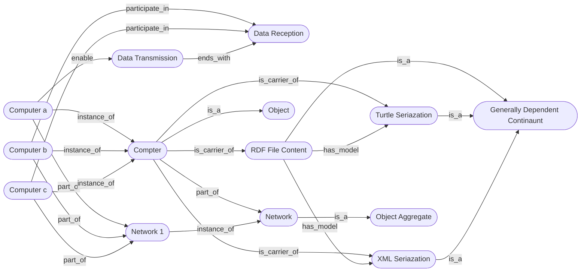
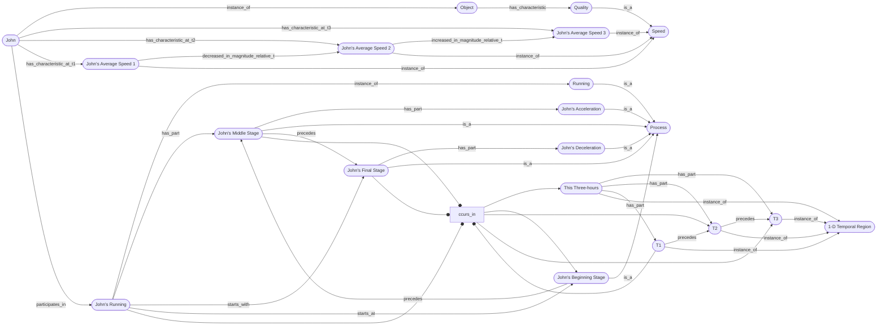

# Project 3

Your third project will require you to answer each of the 10 questions below.  You will be expected to open a pull request with your initial answers by the second class meeting, giving you one week to work on these problems. You and your peers will then have one week to work together to refine your respective initial answers, so they are ready for final submission. Once your pull requests have been reviewed and merged to the development branch, I will review them, then merge to the master branch. 

```
For any question involving the use of Protege, please be sure to import:
1. Basic Formal Ontology (https://raw.githubusercontent.com/BFO-ontology/BFO/v2019-08-26/bfo_classes_only.owl)
2. The Relations Ontology (https://raw.githubusercontent.com/oborel/obo-relations/master/ro.owl)
```

1. In BFO and RO identify at least one object property for each of a-e that _should have the listed property, but which does not_; argue for your case, using examples. Note: It will be easiest to view the object properties in BFO and RO using Protege.
  
  (a)  Reflexive
  Answer: overlaps
  The definition says: x overlaps y if and only if there exists some z such that x has part z and z part of y.
  The object property “overlaps” should be reflexive, if an object has a part which is also a part of other object, the former object must has at least such a part overlaps with itself. So the object property "overlaps" is reflexive. 
  Apartment 202 and Apartment 203 share one adjoining wall. 202 overlaps 203 because they have the wall as a part of both 202 and 203. Besides, 202 also overlaps itself, since any part of 202 is also a part of itself. 

  (b)  Transitive 
  Answer: branching part of 
  The definition says: x is a branching part of y if and only if x is part of y and x is connected directly or indirectly to the main stem of y.
  "branching part of" should be transitive because if a branching_part_of b and b branching_part_of c, then, first, a part_of b, and b part_of c, and second, a is connected directly or indirectly to the main stem of b, and b is connected directly or indirectly to the main stem of c.                       Since part_of(instance level) is transitive, so is connected directly or indirectly to the main stem, a branching_part_of c. 
  
  (c)  Symmetric
  
  Answer: partially overlaps
  The definition: x partially overlaps y iff there exists some z such that z is part of x and z is part of y, and it is also the case that neither x is part of y or y is part of x. As a result, in any case where x partially_overlaps y, there must be a z that is part_of both x and y in which z is not identical with x or y. Therefore for x, y, partially overlaps can be inverse applied, which means y necessarily partially_overlap x. 

  
  (d)  Functional 
  
  Answer: has end location  
  "has end location" should be functional, since for whatever location there can only be one end.
  
  (e)  Symmetric and Reflexive
  
  Answer: spatially coextensive with
  Since x always has the same location with x, and if x spatially coextensive with y, y spatially coextensive with x, so the property should be symmetric and reflexive.

2. In BFO and RO identify at least one object property for each of a-e that _should not have the listed property, but which does_; argue for your case, using examples. Note: It will be easiest to view the object properties in BFO and RO using Protege.

  (a)  Irreflexive
  
  Answer: has role in modeling  
  The definition says: A relation between a biological, experimental, or computational artifact and an entity it is used to study, in virtue of its replicating or approximating features of the studied entity.
   The irreflexive property relation is such that an entity having the property cannot relate to itself. However, if a machine that is designed to model aspects of itself. It can be used to study itself, in virtue of its ability to reflect aspects of itself. 
  
  (b)  Transitive 
  
  Answer: aligned with
  In BFO and RO, the property "aligned with" is transitive, which means if a is aligned with b, and b is aligned with c, then a is aligned with c. In addition, aligned with can be applied to both occurrent entities, say processes, and continuant entities, such as individuals with blood relationships.
  
  The counterexample can be the cases that involves possible worlds. For example, m is aligned with n in the actural world, and n is aligned with q in a possible world, then it may not be the case that m is aligned with q. 
  
  (c)  Asymmetric
  
  Answer: has role in modeling.
  The definition: A relation between a biological, experimental, or computational artifact and an entity it is used to study, in virtue of its replicating or approximating features of the studied entity.
  If a relational quality between artifact x and y is asymmetric per se, then it follows that there are no such cases where the relationship between artifact x and entity y is symmetric. But it is possible that an artifact x's relation to entity y may be in some cases symmetric.  
 

  (d)  Functional
  
  Answer: characteristic of 
  The definition: a relation between a spefically dependent continaunt (the characteristic) and any other entity (the bearer), in which the characteristic depends on the bearer for its existence. The RO "characteristic of" is functional, which means, if x is characteristic of y, there is only one bearer y for any x. However, for a given characteristic, there can be more than one bearer. 
     
  
  (e)  Inverse Functional
  
  Answer: has charcteristic 
  The definition is the inverse of “characteristic of”. This answer relies on what was said in (d), but is its inversion. 


3. Model the following natural language expressions using terms from BFO and RO; you are welcome to introduce new terms where needed:  

  (a) Sally has an arm Tuesday but does not have an arm Wednesday. 
  
   Answer:  "Sally participates_in having at least one arm on Tuesday" and "Sally participates_in having no arms on Wednesday"
   
           Sally is instance_of object
           Tuesday is instance_of one-dimensional temporal region 
           Wednesday is an instance of one-dimensional temporal region 
           Arm is an instance of fiat object part
           having at least on arm is instance_of process
           having no arms is instance_of process
            
           “Sally participates in having at least one arm” is an relation connecting Sally, as an instance_of object, to having at least one
           harm, an instance_of occurrent, and “Sally participates in having at least one arm on Tuesday” is an relation connecting “Sally participates in
           having at least one arm” to Tuesday, an instance of one-dimensional temporal region.  
           
           “Sally participates in having no arms” is an relation connecting Sally, as an instance_of object, to having no harms, an instance 
           of occurrent, and “Sally participates in having no arms on Wednesday” is an relation connecting “Sally participates in having no arms” to
           Wednesday, an instance of one-dimensional temporal region.
           
           We don't know whether Tuesday precedes Wednesday. 
   
  (b) Every liver has some cell as part at all times it exists.
  
   Answer: Liver has_part_at_all_times Cell
   
   Liver is a class in Uberon (UBERON_0002107), which is a subclass of material entity. Cell is also a subclass of material entity. has_part_at_all_time 
   is a temporal qualified relation, which connect two continuants, meaning that the latter is a spatial part of the former at all time when the former
   exists. 
  
  (c) John was a child, then an adult, then a senior. 
  
  Answer:  John participates_in john's childhood precedes John participates_in John's adulthood which precedes John participates_in John's seniorhood
  
     John is an instance_of object
     John's childhood is an instance_of occurrent.
     John's adulthood is an instance_of occurrent.
     John's seniorhood is an instance_of occurrent.
     precedes is a relation connecting two occurrents, in which the former precedes the latter. 
     
  
  (d) Goofus and Gallant are married at each point in a three year span. 
  
  Answer: Goofus participates in marriage at t1  and  Galland participates in marriage at t1.
  
   Goofus is an instance_of object
   Gallant is an instance_of object
   Marriage is an instance_of occurrent
   “Three years span 1” is an instance_of one-dimensional temporal region.
   Goofus and Gallant may be not married to each other.

4. Using the language of First-Order Logic, represent the following natural language expressions; you are welcome to introduce new terms where needed: 

  (a) Sally has an arm Tuesday but does not have an arm Wednesday. 
  
   ∃x (Tx ∧ ∃y (Hsy∧Ay)) ∧ ∃x (Wx ∧ ~∃y(Hsy∧Ay))
    T: Tuesday
    H: has
    A: arm
    W: Wednesday
    s: Sally
 
  (b) Every liver has some cell as part at all times it exists.
   
   ∀x∃y(Lx→Cy∧Pyx)
     L: liver
     C: cell
     P: part of
  
  (c) John was a child, then an adult, then a senior. 
  
  j = John
  E (x, y) = being earlier than
  C (x, t) = being a child at t
  A (x, t) = being an adult at t
  S (x, t) = being a senior at t
  
  ∃t1∃t2∃t3 (C (j, t1) ∧ A (J, t2) ∧ S(J, t3) ∧ E (t1, t2) ∧ E (t2, t3)) 
  
  (d) Goofus and Gallant have been married for three years; for each day of that span, it is true to assert they are married. 
     
     M(x, t) = being married at t
     Y(t) = belongs to 3 year span 1
     g1 = Goofus
     g2 = Gallant
     D(t) = t is a day
      
     ∀t(D(t) ∧ Y(t)→(M(g1,t) ∧ M(g2,t)))


5. Using BFO and RO, model the following scenario: the content of an rdf file is represented in two serializations - one in Turtle, one in XML - which are sent from one computer to two distinct computers on the same network.   



1. RDF File Content, Turtle and XML are all generically dependent continuants. RDF File Content has_model in Turtle and XML. And they are all carried by Computer.
2. Computer a enables the process of Data Transmission, which ends_with another process, Data Reception, which has computers b and c as participants. So this part is intended to show that there is some data (Turtle and XML) which are sent from Computers a to Computer b and c.
3. Computers a, b, and c are all parts_of network I, which is instance_of Object Aggregate.

6. Using Protege, place these in the BFO hierarchy where you think they fit best:

  (a) Bach's Well-Tempered Clavier
  
  instance_of Generically_dependent_continuant
  
  (b) Chair of the UB Philosophy Department
  
  is_a Role
  
  (c) SARS-CoV-2
  
  is_a Object, can also be a BFO: Deposition, if it is regarded as a disease.
  
  (d) Mexico City
  
  instance_of Site
  
  (e) The trunk of a minivan
  
  is_a Fiat_objecty_part
  
  (f) Occupation
  
  instance of Role
  
  (g) Ocean
  
  instance of Site
  
  (h) Lake
  
  instance of Site

7. True or False; explain your answers:

  (a) An instance of Material Entity can have an instance of Immaterial Entity as part.
  
  True. For example, Mike's soul, which is an instance of Immaterial Entity, is continuant_part_of Mike. Also, according to Smith (textbook), 
  “Immaterial entities listed under 1. (boundaries and sites) are in some cases continuant parts of their material” (p. 108). 

  (b) An instance of Immaterial Entity can have an instance of Material Entity as part.
  
  False. According to its definition in BFO, any immaterial entity contains no material entities as parts (Arp, Smith & Spear 2015: 107).
  
  (c) An organization may have another organization as part.
  
  True. For example, a college can have a law school as its part.
  
  (d) An organization may have no members as part. 
  
  True. If a club, say chess club in a school is viewed as a role,  the chess club could lose all its members while still being recognized by
  the school. 
  
  (e) Any site is partially bounded by some instance of Material Entity.
  
  False. If a space is surround by other spaces, the boundaries are not material entities.
  
  (f) A book placed under the leg of a wobbly table has acquired a new function. 
  
  False. Because function is subProperty of disposition, and there should be physical change (makeup)involved. 
  The book did not gain a new function: it had already had the function. 
  
  (g) A glass vase cushioned with packing material for all time, has the disposition to break. 
  
  True, since dispositions are in virtue of the bearer’s physical make-up.
  
  (h) Spacetime is a class in BFO.
  
  False. Spacetime is the whole of spatiotemporal regions (it can be a reference system), and the latter belongs to a BFO class: 
  Spatiotemporal Region.
  
  (i) The continuant fiat boundary class of BFO is closed, meaning, there are no subclasses beyond those identified presently in BFO. 
  False. As its entry in BFO file says, Continuant fiat boundary doesn't have a closure axiom because the subclasses don't necessarily exhaust all 
  possibilities. An example would be the mereological sum of two-dimensional continuant fiat boundary and a one-dimensional continuant fiat boundary 
  that doesn't overlap it.


8. Model the following scenario in BFO, introducing whatever terms are needed to do so: John runs for 3 hours, startin slowly, speeding up during the middle, then ending the run at a slower pace.  



The above graph represents the following relations:

John (as an Object) participates_in John’s Running (as a process).
John has_characteristic_at_t1 John’s Average Speed 1.
John has_characteristic_at_t2 John’s Average Speed 2.
John has_characteristic_at_t3 John’s Average Speed 3. 
All of these speeds are instances of Quality. 

John’s running includes 3 temporal parts: 
John’s Beginning Stage, John’s Middle Stage, and John’s Final Stage, each of which is a process. 
John’s Beginning Stage precedes John’s Middle Stage which precedes John’s Final Stage.

John’s running occurs_in This 3-hour, which is instance_of 1-D Temporal Region. 
This 3-hour includes 3 temporal parts: T1, T2, and T3, each of which is also instance_of 1-D Temporal Region. Besides, T1 precedes T2, and T2 precedes T3. 
John’s Beginning Stage occurs_in T1, John’s Middle Stage occurs_in T2, and John’s Final Stage occurs_in T3.

Change in John’s speed: 
John's Average Speed 1 is decreased_in_magnitude_relative_to John's Average Speed 2 (that is, speed 1＜speed 2)
John's Average Speed 2 is increased_in_magnitude_relative_to John's Average Speed 3 (that is, speed 2＞speed 3). 
John's Middle Stage has_part John's Accelerating
John's Final Stage has_part John's Decelerating. 
John’s Accelerating and John's Decelerating are both instances of Process.


9. The Pellet reasoner in Protege can be used in an incremental reasoning strategy. ELI5 when and why one should use Pellet for incremental reasoning. 

ChatGPT's answer
ELI5: Imagine you are playing with some building blocks to build a tower. Every time you add a block to the tower, you don't need to start building the tower from the beginning. You just need to add the new block on top of the tower.
In the same way, when we use Pellet to reason about an ontology, we don't need to start reasoning from the beginning every time we add new information to the ontology. Instead, Pellet remembers what it has already figured out and uses that knowledge to figure out what the new information means. This is kind of like adding a new block to the tower without starting from the beginning. Thus, Pellet is especially important for large, complex ontologies where re-computing all the results every time new information is added would take a long time. 


10. Protege reasoners will not allow you to combine certain properties, e.g. reflexivity and transitivity. If you attempt to assert such pairs of the same object property, then run the reasoner, nothing will happen. If you combine such properties while a reasoner is running, then ask to synchronize the reasoner, an error will be thrown. Provide a table or series of tables illustrating which pairs of properties cannot be combined in Protege, either because nothing happens when the reasoenr is run or because an error is thrown when synchronizing a reasoner after making such changes. Review the github docs on [creating tables in markdown](https://docs.github.com/en/get-started/writing-on-github/working-with-advanced-formatting/organizing-information-with-tables).

```
-----------------------------------------------------------------------------------------------------
pairwise   | Functional | InverseFun | Transitiv | Symmetric | Asymmetric | Reflexive | Irreflexive |
-----------------------------------------------------------------------------------------------------
Functional |            |    Y       |    N      |     Y     |     Y      |     Y     |      Y      |
-----------------------------------------------------------------------------------------------------
InverseFun |     Y      |            |    N      |     Y     |     Y      |     Y     |      Y      |
-----------------------------------------------------------------------------------------------------
Transitive |     N      |    N       |           |     Y     |     N      |     Y     |      N      |
-----------------------------------------------------------------------------------------------------
Symmetric  |     Y      |    Y       |     Y     |           |     N      |     Y     |      Y      |
-----------------------------------------------------------------------------------------------------
Asymmetric |     Y      |    Y       |     N     |     N     |            |     N     |      Y      |
-----------------------------------------------------------------------------------------------------
Reflexive  |     Y      |    Y       |     Y     |     Y     |     N      |           |      N      |
-----------------------------------------------------------------------------------------------------
Irreflexive|     Y      |    Y       |     N     |     Y     |     Y      |     N     |             |
-----------------------------------------------------------------------------------------------------

```

Note: In the above table, there are 21 different possibilities of combinations in total. "Y" represents a case where a pair of object property characteristics can be combined, and "N" represents a case where a pair of object property characteristics cannot be combined.

In short, there are 7 pairs cannot be combined.
Among them, Asymmetric & Reflexive, Asymmetric & Symmetric, Reflexive & Irreflexive cannot be combined because of the logically contradiction. 
Transitive & Functional, Transitive & Inverse Functional, Transitive & Asymmetric, and Transitive & Irreflexive cannot be combined because the cases are beyond the capacity limit of the reasoner. 


